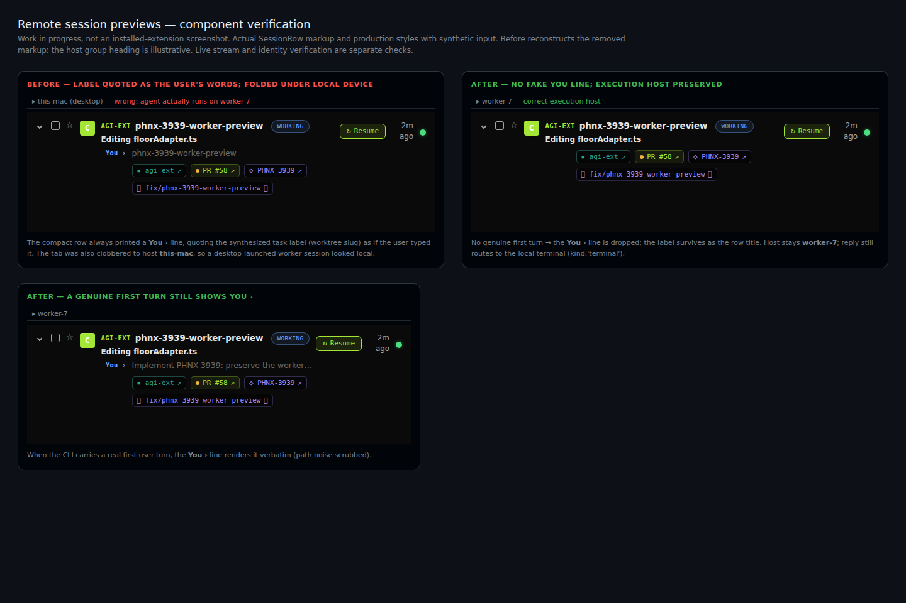

## Summary

The user should see the worker's actual conversation while retaining its remote execution metadata. The CLI owns session identity, cross-device reconciliation and previews. The extension subscribes and renders; it must not recreate those mechanisms.

<aside class="artifact-callout artifact-callout-warn">Delivery checkpoint, September 6: the extension, canonical identity hook and activity-reader CPU fix are merged. The hook is installed and verified; extension 0.9.365 is packaged. The CLI change awaits a green runtime-budget check and release. No task fix is loaded in the user's editor, and the editor window has not been reloaded.</aside>

<figure class="artifact-figure artifact-figure-diagram artifact-figure-wide">
<svg class="artifact-diagram" viewBox="0 0 960 230" role="img" aria-label="The worker transcript flows through the CLI's canonical session projection and one demand-gated extension monitor to the visible conversation row.">
<rect x="20" y="52" width="190" height="95" rx="8" fill="#16120a" stroke="#f59e0b" stroke-width="1.5"/>
<text x="36" y="78" font-family="Inter,system-ui,sans-serif" font-size="14" fill="#c8c8c8">Worker transcript</text>
<text x="36" y="102" font-family="Inter,system-ui,sans-serif" font-size="11" fill="#8a8a8a">Native ID and conversation</text>
<text x="36" y="124" font-family="Inter,system-ui,sans-serif" font-size="11" fill="#8a8a8a">Hook proves live identity</text>
<path d="M210 99 H245" fill="none" stroke="#38bdf8" stroke-width="2"/>
<path d="M237 94 L245 99 L237 104" fill="none" stroke="#38bdf8" stroke-width="2"/>
<rect x="245" y="52" width="210" height="95" rx="8" fill="#0e1418" stroke="#38bdf8" stroke-width="1.5"/>
<text x="261" y="78" font-family="Inter,system-ui,sans-serif" font-size="14" fill="#c8c8c8">CLI session projection</text>
<text x="261" y="102" font-family="Inter,system-ui,sans-serif" font-size="11" fill="#8a8a8a">Owner row plus origin bindings</text>
<text x="261" y="124" font-family="Inter,system-ui,sans-serif" font-size="11" fill="#8a8a8a">Preview, attention, remote host</text>
<path d="M455 99 H490" fill="none" stroke="#38bdf8" stroke-width="2"/>
<path d="M482 94 L490 99 L482 104" fill="none" stroke="#38bdf8" stroke-width="2"/>
<rect x="490" y="52" width="210" height="95" rx="8" fill="#0e1418" stroke="#38bdf8" stroke-width="1.5"/>
<text x="506" y="78" font-family="Inter,system-ui,sans-serif" font-size="14" fill="#c8c8c8">One elected monitor</text>
<text x="506" y="102" font-family="Inter,system-ui,sans-serif" font-size="11" fill="#8a8a8a">Demand-gated feed child</text>
<text x="506" y="124" font-family="Inter,system-ui,sans-serif" font-size="11" fill="#8a8a8a">Replay and verified cleanup</text>
<path d="M700 99 H735" fill="none" stroke="#38bdf8" stroke-width="2"/>
<path d="M727 94 L735 99 L727 104" fill="none" stroke="#38bdf8" stroke-width="2"/>
<rect x="735" y="52" width="205" height="95" rx="8" fill="#0f160a" stroke="#a3e635" stroke-width="1.5"/>
<text x="751" y="78" font-family="Inter,system-ui,sans-serif" font-size="14" fill="#c8c8c8">Extension row</text>
<text x="751" y="102" font-family="Inter,system-ui,sans-serif" font-size="11" fill="#8a8a8a">Actual conversation preview</text>
<text x="751" y="124" font-family="Inter,system-ui,sans-serif" font-size="11" fill="#8a8a8a">Remote host; local reply tab</text>
<text x="490" y="180" font-family="Inter,system-ui,sans-serif" font-size="12" fill="#f59e0b">Original break: this producer was deleted in extension PR #52.</text>
<text x="20" y="211" font-family="Inter,system-ui,sans-serif" font-size="11" fill="#8a8a8a">Proposed data path. The diagram is not evidence that the changed flow is installed.</text>
</svg>
</figure>

## Findings

| Finding | Evidence | Owning fix |
| --- | --- | --- |
| The extension receives no canonical session feed | Extension commit `e0f4831` removed `sessionCliStream.ts` and host start/replay wiring. Installed `0.9.364` monitor bundle has no producer, while the consumer remains. | Restore one demand-gated producer in the elected monitor, not an always-on watcher per window. |
| An empty desktop observation can hide the worker's conversation | A bounded native desktop feed returned an empty origin row and a populated worker row for the same session. The extension's first-match join selected the origin. | Reconcile owner and observation rows in the CLI; retain remote execution identity and explicit observer-terminal bindings. |
| A Codex fork can overwrite its parent's indexed identity | A real child rollout contains child metadata first and inherited parent metadata later. The reducer assigned every `session_meta.id`, so the last metadata won. | Treat the first authoritative native metadata as identity; repair cached extraction and affected index rows. |
| A restricted process view can erase live host identity | A host process was alive over native SSH but invisible to the sandbox. PID pruning treated invisibility as death. | Authorize shared registry/cache writes and hook writes using actual process ownership; a foreign namespace must not infer death from invisibility. |
| A headless child can inherit an editor terminal binding | Dispatch and execution copied the parent's terminal ID into detached launches. | Keep child lineage separate from ownership of the editor's terminal. |

The unsafe namespace cleanup was also encountered during this investigation: an early sandbox-side active-session probe could trigger it. That does **not** establish it as the cause of the original screenshot. The deleted extension producer is independently confirmed in the installed bundle.

## Evidence

### Confirmed regression attribution

[Extension PR #52](https://github.com/phnx-labs/agi-ext/pull/52), merged September 4, removed the feed to address sustained CPU and SSH-child costs. It also removed the producer tests while leaving the presentation store and its consumers. A manually started CLI feed was able to return worker data; that was not proof the extension received it.

### Activity cost: measured on September 6

The canonical activity reader reparsed historical tails before applying its cursor on every feed poll. [PR #3490](https://github.com/phnx-labs/agi-cli/pull/3490) caches file-version-validated tails and compact timestamp summaries without changing the watch interval.

| Same worker, measured 261-log corpus | Before | After |
| --- | ---: | ---: |
| 60 activity cursor reads | 2,479.91 ms | 111.75 ms |
| CPU used during a bounded 15-second native feed run | 2.75 seconds | 1.19 seconds |
| Independently rerun activity tests | — | 85 passed |

These gains are specific to the measured corpus. Installed-desktop verification then found 1,293 logs, above the cache's 1,024-entry limit. Sixty warmed future-cursor reads took 6,540.81 ms and returned zero events. The sequential scan still churns the cache at that scale, so a bounded-memory summary-retention correction is required before the extension feed is restored. This desktop result must not be compared directly with the smaller worker corpus. The original required CI check was green at 65 seconds, exceeding the repository's 60-second target; no gate was relaxed.

```text
PR #3490: MERGED
Merge commit: f9e36d645a42ee3ef1d7edc05cff8e267df48e4c
Independent review: APPROVE
Activity tests: 85 passed
Release: 1.22.83, verified to contain the merge commit
Installed desktop: 1.22.83, real activity reader exercised
Desktop-scale cache correction: in progress
```

### Review found meaningful integration failures

| Sequence or boundary | Failure caught before landing |
| --- | --- |
| Stop an old feed child, immediately start another | The old exit callback could clear the new child and permit duplicate producers. |
| Question A resolves, then question B arrives | The store retained resolved A and selected it before active B. |
| The worker owns the session; the desktop owns its terminal | The CLI published `observerTerminals`, but the extension did not consume them. |
| SessionStart rewrites a launcher PID entry | The hook discarded newly added provenance fields; a sidecar and canonical hook protection are required. |
| A private container restarts with persistent home | Kernel boot stays the same while its PID namespace changes; a permanent namespace pin would reject the replacement. |

These findings were resolved or explicitly scoped out before approval. Passing source checks and a merged PR are not claims of installed delivery.

The composed CLI projection and extension store now preserve worker previews and distinguish two desktops using the same terminal identifier. Successive attention generations also pass through both the live store and late-follower replay. The actual terminal-hydration and fork callers now supply the observer hostname. Independent verification passed 31 focused tests and returned the expected identities through the real functions:

```json
{"hydrated":"S","otherHydrated":"S2","fork":"S","otherFork":"S2","wrongWorker":null}
```

These identifiers are synthetic. The hydration/attention contract review is approved. Independent lifecycle verification passed 38 tests, including two real editor-window processes and three real producer/descendant termination scenarios. Its scope is graceful handoff and cleanup within the owned POSIX process group—not abrupt extension-host death, escaped groups, Windows descendants, or the pre-existing bootstrap election race.

The broader UI composition check caught two additional defects: one canonical worker session attached to a local editor tab produced two Sessions rows, while both were hidden from the default live view when the execution context was `headless`. The merged extension now composes the tab onto its canonical session once and retains attachment as separate presentation metadata. Independent UI verification passed 186 tests.

The identity review is approved. Ownership compares boot ID, namespace ID and init start ticks consistently, so a recycled namespace ID cannot inherit a previous namespace's authority. The canonical hook is merged, synced and registered on the interactive desktop and execution workers; source and installed hashes match. Real integration tests using the installed hook passed 21 tests. The CLI half is not released yet.

Scope decision: automatic takeover of a persistent private-container home is not part of this physical-worker fix. A CLI running beneath a separate container init cannot prove that an invisible namespace is dead. The experimental PID-1 lease was removed; foreign namespace writes fail safely, while verified native-host migration and reboot recovery remain supported. Namespace-local ephemeral stores would be a separate design if automatic container-home reuse is needed.

### Final platform checks and remaining release gate

The macOS run exposed a genuine teardown defect: signalling a zombie-only process group returned `EPERM` in 100 of 100 probes. The extension now accepts that result only after successful inspection proves there are no live group members. Live members and inspection failures still reject cleanup. A real-process regression first observes the zombie and `EPERM`, then verifies cleanup and socket removal.

| Check | Verified result |
| --- | --- |
| Combined extension lifecycle and identity checks, three scheduled repetitions | macOS: 222 passed; Linux: 219 passed, 3 Darwin-only skipped |
| Independent subprocess and handoff rerun | 9 passed |
| Final macOS package | 0.9.365, 25.34 MB; runtime native dependencies verified |
| CLI affected checks on worker | 2,854 passed, 7 skipped; complete impact run 120 seconds |
| CLI hosted check | 2,842 passed, 19 environment-specific skips; failed total runtime gate at 263 seconds against 240 seconds |

The hosted failure is a timing failure, not a failing assertion. The limit remains unchanged and the PR is not being merged while red. These results are recorded on [CLI PR #3497](https://github.com/phnx-labs/agi-cli/pull/3497) and [extension PR #58](https://github.com/phnx-labs/agi-ext/pull/58).

## Recommendations

Implement the data path shown above: CLI-owned reconciliation and identity, a single lifecycle-safe monitor subscription, and a thin presentation store. Preserve the execution host separately from the desktop reply transport. Display “You” only for an actual user turn, never a synthesized task label.

<figure class="artifact-figure">

<figcaption>Actual component markup and production styles, rendered headlessly and inspected. Synthetic input; reconstructed before state; illustrative host headings. This is not an installed-extension screenshot.</figcaption>
</figure>

The release must compose the CLI, canonical session-start hook and extension contract. Verification must include live worker data, successive attention generations, observer-scoped terminal lookup and real child cleanup. A styled synthetic component render is useful visual evidence, but it does not replace installed-flow verification.

The user's no-reload constraint remains binding. Packaging or installing a VSIX does not prove the already-open VSCodium window loaded it; the final handoff must state that limitation explicitly.

## Tracking

- PHNX-3939: existing umbrella ticket; unrelated sections remain open.
- [Original extension regression, PR #52](https://github.com/phnx-labs/agi-ext/pull/52).
- [Merged activity CPU fix, PR #3490](https://github.com/phnx-labs/agi-cli/pull/3490).
- [CLI identity and worker projection, PR #3497](https://github.com/phnx-labs/agi-cli/pull/3497): awaiting green CI and release.
- [Canonical identity hook, PR #442](https://github.com/phnx-labs/.agents/pull/442): merged, installed and verified.
- [Extension integration, PR #58](https://github.com/phnx-labs/agi-ext/pull/58): merged and packaged; not loaded in the active editor.
