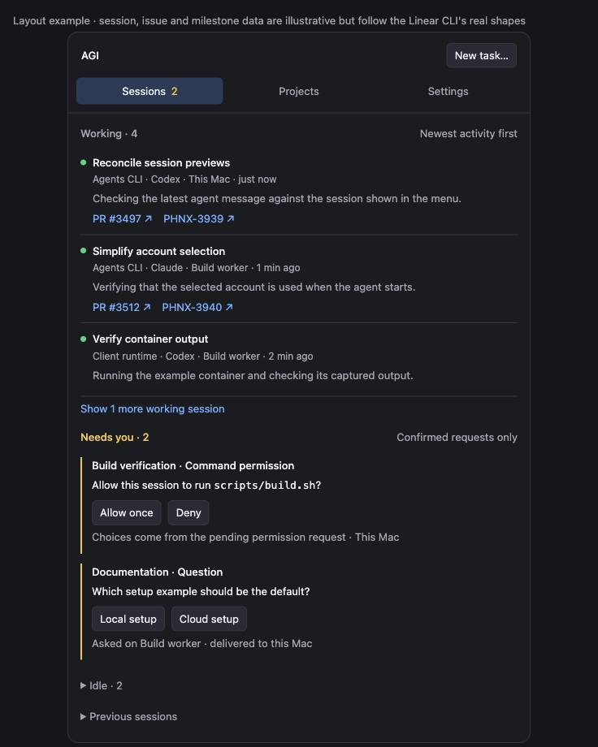
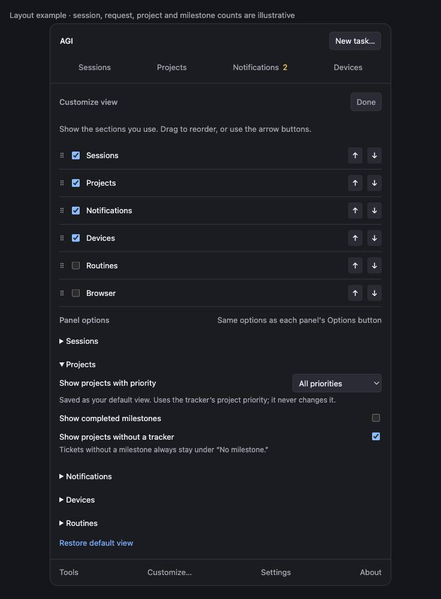
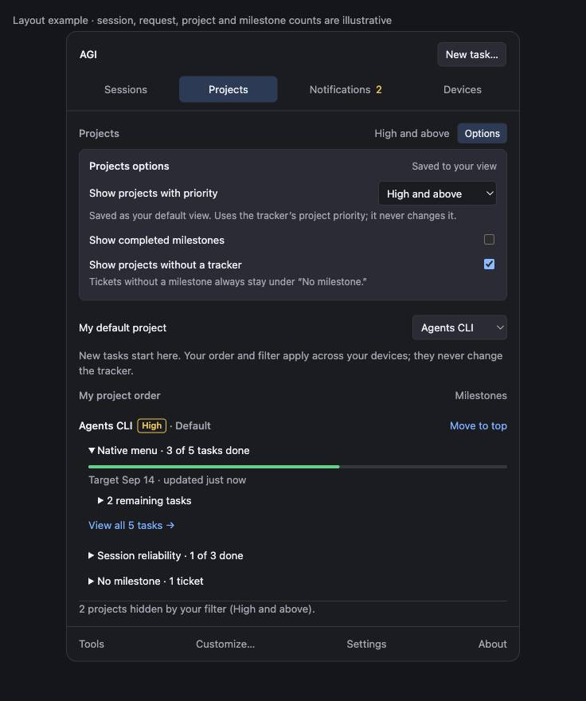
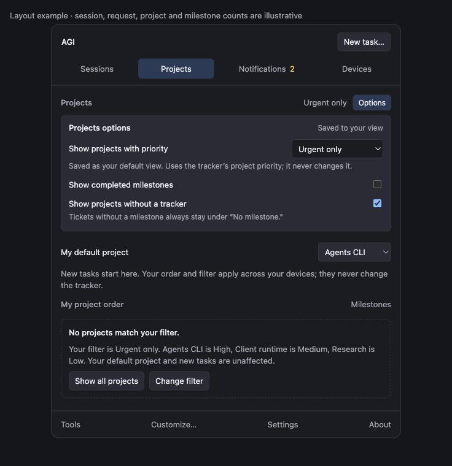

## Focus for review

Keep the existing native notification delivery and reply mechanism. Fix the shared request state before putting a number on the new Notifications tab.

- Start with one rich session list, working first and three rows initially; let the user change the row limit and preview density.
- Add Customize view: enable or hide sections, drag to reorder, and adjust each panel. Keep Customize available even when every section is hidden.
- Give every panel an Options button with the same saved options Customize shows. Projects can be filtered by tracker priority (All, Urgent only, High and above, Medium and above) as the user's default view. All four live Linear projects are Low today, so a High-and-above default shows an empty state with a way back to all projects.
- Put requests in Notifications. Its badge counts unresolved requests; remove competing “needs you” totals from the header and session groups.
- Store a personal default project separately from personal project order. Put tickets inside Projects → Milestones → Tickets, with a “No milestone” group.

<aside class="artifact-callout">Review draft only. No product changes have been made. The clickable layout uses illustrative counts, including its two requests; those are not a measurement of live sessions.</aside>

<figure class="artifact-figure artifact-behavior">
<section data-state="current" data-evidence="mockup">
<h3>Current menu: duplicated sessions and unrelated counts</h3>
<svg viewBox="0 0 480 390" role="img" aria-label="An anonymized reconstruction of the supplied native menu: version banner, three different attention counts, active sessions, routines, tickets, rich recent sessions, and notifications">
<rect x="1" y="1" width="478" height="388" rx="12" fill="#24252b" stroke="#454650"/>
<g font-family="system-ui,sans-serif" font-size="15" fill="#f2f2f5">
<text x="18" y="30" fill="#b2b4be">agents-cli 1.22.92</text><text x="300" y="30" fill="#f4cf73">1 needs you</text>
<path d="M18 44H462M18 108H462M18 182H462M18 249H462M18 339H462" stroke="#454650"/>
<text x="18" y="70">Sessions</text><text x="112" y="70" fill="#f4cf73">10 need you</text>
<text x="18" y="96" fill="#f4cf73">NEEDS YOU (3): load + routine problems</text>
<text x="18" y="133" fill="#b2b4be">ACTIVE · grouped by project</text>
<text x="30" y="157">Agent · host · terminal · first-line preview</text>
<text x="18" y="207" fill="#b2b4be">ROUTINES</text><text x="18" y="233" fill="#b2b4be">RECENT TICKETS</text>
<text x="18" y="274" fill="#b2b4be">RECENT · same sessions again</text>
<text x="30" y="301">Session title · status · age</text><text x="30" y="322" fill="#b2b4be">Fuller preview and PR text</text>
<text x="18" y="367">Notifications</text><text x="170" y="367" fill="#b2b4be">No notifications today</text>
</g></svg>
<figcaption>Layout reconstructed from the owner's screenshots. The three totals measure different things. Native Notification Center can contain banners while this submenu is empty.</figcaption>
</section>
<section data-state="proposed" data-evidence="mockup">
<h3>Proposed: working sessions first, one Notifications badge</h3>

<figcaption>Illustrative layout. Clicking a session opens its details; PR and ticket links have independent actions. Version information moves to About.</figcaption>
</section>
</figure>

<figure class="artifact-figure">

<figcaption>Customize appears only while editing the view. A section can be hidden without disabling its underlying service. Panel options here and each panel's Options button read the same option table, so nothing is defined twice.</figcaption>
</figure>

<figure class="artifact-figure">

<figcaption>Projects → Options. The priority filter is saved as this user's default view. Each project shows its tracker priority, and a footer line counts what the filter hid. The default-project selector is never filtered.</figcaption>
</figure>

<figure class="artifact-figure">

<figcaption>Empty state when the saved filter matches nothing. Show all projects is a temporary override that does not change the saved filter; Change filter reopens Options. This is the state a High-and-above default would show against today's tracker, where every project is Low.</figcaption>
</figure>

## Purpose

Make the everyday menu useful without scrolling through duplicate session inventories. The owner wants to see running agents first, understand their latest work, open their linked PR or ticket, and find personal priority projects and milestone tasks.

Input alerts must explain the actual pending decision. An agent finishing a turn is not evidence that it requires approval. A question, an approval, a failure and a completed task need different presentation.

This change reuses the CLI session/feed engine, native app, answer transport and tracker integration. It does not create another scheduler, change shared tracker priorities, assign tasks to milestones automatically, or replace the extension's session implementation. Working-first ordering is the owner's explicit choice for this menu; a confirmed request remains visible in the Notifications badge.

## Live findings

Audit: installed agents-cli 1.22.92, source base `c98582f47230`, September 10, 2026, approximately 00:42–00:45 Pacific. The captured fleet feed contained **nine attention records, all classified as permission**. Eight originated as `idle_prompt`; one originated as `permission_prompt`. These are observed classifications, not nine verified human decisions. One fleet scope was unavailable, so the snapshot is not a complete fleet census.

| Inspected session | Actual current evidence | Assessment |
| --- | --- | --- |
| Completed “pong” task | User requested exactly `pong`; assistant replied `pong`, ended its turn, and the live terminal has an empty prompt. An idle reminder arrived one minute later. | Confirmed false “needs input”; no permission dialog or unfinished task. |
| Cloud command | Current terminal explicitly asks “Do you want to proceed?” and offers Yes / session allowance / No. | Confirmed pending permission, despite being old. Age alone cannot clear it. |
| Browser integration | Last response asks which browser data directory to use; current terminal is at an empty prompt. | A real free-text choice, incorrectly classified as command permission. |
| Report update | Last response describes actions awaiting the user's go-ahead; no pending tool appears in the transcript. | A conversational consent request, not evidence for command permission buttons. |

Processes, transcript records, hook files and two remote terminal panes were checked; a local browser-integration terminal capture was inspected. No input was sent to these sessions. Raw identifiers and captures remain in ignored task scratch because they contain private session data. This small, selected sample does not establish a reliability percentage.

The incoming hook preserves `notificationType`, but `kindFromBlock` maps every notification to permission: [`feed.ts:799`](https://github.com/phnx-labs/agi-cli/blob/c98582f47230/cli/src/lib/feed/feed.ts#L799), [`attention.ts:261`](https://github.com/phnx-labs/agi-cli/blob/c98582f47230/cli/src/lib/feed/attention.ts#L261). This explains how the generic “Claude is waiting for your input” message can receive Approve/Deny controls. It does not independently establish the origin of every historical banner in the screenshots.

Other confirmed defects compound the problem:

- The menu's Notifications submenu reads raw feed blocks within 24 hours, while banners use reconciled attention. Failed loading is rendered as an empty list. Its “unanswered” flag incorrectly uses deliverable attribution (`ticket`, `pr`, `worktree`, `unassigned`): `RecentSectionBuilder.swift:244–284`, `feed-outcome.ts:22–29`.
- Native request IDs already use the attention key, but the helper never withdraws delivered notifications when that request resolves. Delivery is marked before confirmed posting: `Notifier.swift:453–458`, `daemon/attention-notify-service.ts:154–155`.
- Fleet attention is visible in the menu; native posting currently begins from local active sessions. A remote row therefore does not prove delivery to the operator's Mac: `daemon/attention-notify-service.ts:118–123`, `menubar/notify-desktop.ts:176–178`.
- The initial 15-task result was a configured agent's open-task subset. A subsequent authenticated `linear tasks --all --project AGI --status open --json` returned 23 open tasks, none assigned to milestones. Historical assignments exist across six milestones. One milestone has 2 completed and 15 canceled tasks; another has 1 completed task. Zero assigned open tasks does not mean empty milestones, and canceled tasks must not look like unfinished work.

## Current architecture

<figure class="artifact-figure artifact-figure-tall artifact-figure-diagram">
<svg viewBox="0 0 440 570" role="img" aria-label="Current component diagram: hooks and session state feed a reconciler for native notifications, while the menu reads both that stream and raw feed blocks separately">
<defs><marker id="current-arrow" markerWidth="8" markerHeight="8" refX="7" refY="4" orient="auto"><path d="M0 0L8 4L0 8Z" fill="#b2b4be"/></marker></defs>
<g font-family="system-ui,sans-serif" font-size="15" fill="#f2f2f5" text-anchor="middle">
<rect x="35" y="15" width="370" height="65" rx="5" fill="#30323b" stroke="#727582"/><text text-anchor="middle" font-size="15" font-family="system-ui,sans-serif" x="220" y="41">Harness hooks + session readers</text><text text-anchor="middle" font-size="15" font-family="system-ui,sans-serif" x="220" y="63" fill="#b2b4be">CLI components · TypeScript</text>
<path d="M220 80V87M220 122V132" stroke="#b2b4be" marker-end="url(#current-arrow)"/><text text-anchor="middle" font-size="15" font-family="system-ui,sans-serif" x="220" y="110" fill="#b2b4be">Hook JSON + transcript state</text>
<rect x="35" y="140" width="370" height="70" rx="5" fill="#30323b" stroke="#727582"/><text text-anchor="middle" font-size="15" font-family="system-ui,sans-serif" x="220" y="167">Attention reconciler</text><text text-anchor="middle" font-size="15" font-family="system-ui,sans-serif" x="220" y="190" fill="#f4cf73">idle notification → permission</text>
<path d="M220 210V217M220 252V259" stroke="#b2b4be" marker-end="url(#current-arrow)"/><text text-anchor="middle" font-size="15" font-family="system-ui,sans-serif" x="220" y="240" fill="#b2b4be">Attention events · NDJSON / CLI calls</text>
<rect x="35" y="267" width="370" height="74" rx="5" fill="#394b68" stroke="#8cbcff"/><text text-anchor="middle" font-size="15" font-family="system-ui,sans-serif" x="220" y="293">Menu rows + native banners</text><text text-anchor="middle" font-size="15" font-family="system-ui,sans-serif" x="220" y="318" fill="#b2b4be">Swift UI · separate counts and history</text>
<path d="M220 405V394M220 363V350" stroke="#b2b4be" marker-end="url(#current-arrow)"/><text text-anchor="middle" font-size="15" font-family="system-ui,sans-serif" x="220" y="378" fill="#b2b4be">Also runs feed --filter all --json</text>
<rect x="35" y="413" width="370" height="70" rx="5" fill="#30323b" stroke="#727582"/><text text-anchor="middle" font-size="15" font-family="system-ui,sans-serif" x="220" y="440">Raw feed blocks</text><text text-anchor="middle" font-size="15" font-family="system-ui,sans-serif" x="220" y="462" fill="#f4cf73">24-hour filter; attribution ≠ answer</text>
<text text-anchor="middle" font-size="15" font-family="system-ui,sans-serif" x="220" y="521" fill="#b2b4be">C4 component view · gray: CLI; blue: UI</text>
<text text-anchor="middle" font-size="15" font-family="system-ui,sans-serif" x="220" y="546" fill="#b2b4be">Arrows name data or command transport</text>
</g></svg>
</figure>

## Proposed Changes

**1. Correct request detection and lifecycle at the CLI source.** Preserve the event subtype and use explicit pending questions, plans and permission requests as evidence. An idle reminder alone creates no permission request. Keep inferred conversational questions labeled as such and open the conversation if the exact response contract is unknown. Never turn a long-running tool into a permission request solely because two minutes passed.

Conceptual changes, not applied patches:

```diff
# cli/src/lib/feed/attention.ts + session/state.ts
- notification => permission; elapsed tool time => permission
+ permission_prompt => permission evidence
+ pending structured question / plan => corresponding request
+ idle_prompt => refresh session state; no automatic approval
+ scoped session + request generation => one unresolved record
```

An open block must be reconciled against later transcript/hook evidence. New work, a tool result, an answer or session completion may resolve the matching generation. Banner dismissal does not answer it. A genuinely old permission remains pending while still confirmed; uncertain stale state becomes “Could not verify request,” with an Open session action and no invented approval controls. Keep actual failed/unfinished work discoverable without labeling every failure a question.

Time-sensitive evidence must expire even when transcript content is unchanged. `active.ts:1291–1292` currently caches computed signals by file mtime and PID liveness, so a 30-minute conversational-question threshold can remain frozen. Cache parsed content separately and recompute time-based classifications; use actual transcript event timestamps, not filesystem mtime, as activity evidence.

**2. Project that same request record everywhere.** The Notifications tab, its badge, session detail and native banners share identity, type, state and supported actions. Remove the separate raw-block menu parser and any status-color fallback that resurrects a resolved request. Use host plus session plus request generation, not bare session ID.

```diff
# RecentSectionBuilder.swift + FeedModels.swift + SessionRowModel.swift
- notifications from raw blocks; unanswered from outcome.kind
- attention lookup by unscoped session ID
+ Notifications from reconciled unresolved requests
+ attribution links independent of request state
+ explicit unavailable state when a feed scope cannot be read

# daemon/attention-notify-service.ts + Notifier.swift
- fire-and-forget delivery; unconditional permission actions
+ acknowledge posting, retry failures, deduplicate request generation
+ render only supported actions; withdraw resolved generation by key
```

Reuse the installed notification sender and `agents feed answer` response path. The daemon, not a UI timer, must own delivery of fleet requests to the selected personal device. Reuse its existing fleet feed aggregation and avoid a new remote poll for each menu view. Verify local and remote delivery, restart replay, and duplicate suppression before claiming this Mac receives the fleet's requests. OS notification history is not the source of unresolved state: users can dismiss a banner without answering.

**3. Replace the long menu with a customizable native surface.** Keep the existing status item, session window, row presentation, feed stream and dispatch behavior. Build the tabbed content in the helper's native popover; the present `NSMenu` does not itself supply this layout. Delete the duplicate ACTIVE/RECENT rendering from the root menu. The excerpt below is a presentation contract:

```diff
# StatusItemController.swift + native session views
- version banner + multiple attention totals
- ACTIVE rows + RECENT rows + expanded auxiliary lists
+ default sections: Sessions | Projects | Notifications | Devices
+ Customize: show/hide + drag order; Routines and Browser optional
+ Options button on every panel; one option table feeds it and Customize
+ Sessions: rows shown, previews, group by project, idle · Devices: offline, load
+ Notifications: other devices, unverified, history · Projects: priority filter,
+   completed milestones, untracked projects; empty state keeps Show all projects
+ one rich session list; configurable working rows + Show more
+ Idle / Previous collapsed; full session opens from its title
+ PR and ticket URLs open directly; version under About
+ Tickets inside Projects → Milestone → Tickets; No milestone preserved
+ Tools / Customize / Settings / About remain accessible
```

A blocked session has its details reachable from its notification, while working rows remain first as requested. No session disappears merely because it is not in the initial three. Device load and routine failures remain labeled diagnostics, excluded from the input-request count.

Customize is an explicit editing mode: visibility checkboxes, draggable section rows, and keyboard-accessible move controls. Each panel exposes only relevant options, reachable two ways: an Options button in the panel header and the Panel options list in Customize. Both render from one option table keyed by section ID, so a new option is declared once. Changing an option saves it to the user's view immediately and says so; there is no separate Save step. Defaults are a starting view, not fixed product policy. Hide/show affects presentation, not native notification delivery, underlying jobs or data. Persist stable section IDs, order, visibility and per-panel options with personal preferences; retain hidden-section settings and offer Restore default view. If the active section is hidden, open the next visible section. If all are hidden, show an empty state with Customize still available. Keep transient expansion separate from the saved default layout.

**4. Normalize links once, upstream.** Keep exact PR repository, number and URL, ticket ID and URL, and separately fetched PR state with freshness. Bind a tool result to the command that produced it; do not attach an unrelated later PR URL. Missing PR checks render “Status unavailable,” not “checks running.” Reuse the preview/identity work in PR #3497 after coordinating ownership.

**5. Add personal projects and real milestone drilldown.** A personal preferences record owns `defaultProjectId`, `orderedProjectIds` and `projectPriorityFilter`; shared `ProjectDef` keeps repository and tracker metadata. Key preferences by signed-in user where available, with an explicit local profile when signed out. Sync only that user's record through the existing user-config mechanism; add its allowlist and merge/isolation coverage rather than promising automatic sync from a new device-only key. Default and priority are separate: changing order must not silently change task destination.

**Priority filter.** `linear projects --json` already returns `priority` as the tracker's integer scale (1 urgent, 2 high, 3 medium, 4 low, 0 none; the labels `linear projects update --priority` accepts). The filter keeps projects at the chosen level and above and is saved as the user's default view. Verified 2026-09-10: all four projects return 4 (Low), so a High-and-above default renders the empty state on day one. That state names each project's priority and offers Show all projects, a temporary override that is not saved, and Change filter. The default-project selector and New task never apply the filter, and the filter never writes to the tracker.

The Projects tab shows ordered projects, declared tracker milestones, progress and update time. Clicking a milestone opens its tickets inside Projects, with a breadcrumb back to the project. There is no separate Tickets tab. Preserve “No milestone,” unlinked projects, empty milestones, canceled tasks, pagination, stale and partial states. A user's completed-milestone option controls presentation, not whether canceled work is incorrectly counted as actionable.

**Use the existing Linear CLI.** Installed `linear-cli 0.21.1` supports the following authenticated reads. The native app already calls it through `AgentsCLI` and `LinearTickets`, including project binding, filters and a 90-second cache; reuse that path.

```sh
linear projects --json
linear milestones list <project-id> --json
linear tasks --all --project <project-id> --milestone <milestone-id> --status open --json
linear tasks --all --project <project-id> --milestone <milestone-id> --status done --json
linear tasks --all --project <project-id> --milestone <milestone-id> --status canceled --json
```

`--all` removes the configured agent/delegate filter; explicit `--project` still scopes results. It does not include completed/canceled work without the status flag. Projects/milestones span all cycles. For “No milestone,” fetch the project's tasks and select records with null `projectMilestone`; `--assignee none` means no person assigned and is not equivalent.

Two small changes belong in the owning Linear CLI before the richer UI ships: expose milestone rollups and milestone IDs on task JSON, and paginate milestone declarations with coverage metadata. Currently milestone JSON has IDs but no counts; task JSON has milestone name but no ID; human rollups count completed as done while including canceled in the denominator. Milestone list stops at 100, project detail at 50. Task queries paginate in 100-record pages up to a safety cap and must expose partial coverage. Reuse or extend the Linear CLI contract rather than add another GraphQL client in the menu or poll broad fleet-probing `projects status` on redraw.

Existing `UserDefaults` patterns cover dispatch defaults and project selection, but no persisted menu section order exists. Reuse these controls and consolidate the local project-to-Linear override with the canonical binding. Saved default project is distinct from the most recently selected project and from section order.

## Proposed architecture

<figure class="artifact-figure artifact-figure-tall artifact-figure-diagram">
<svg viewBox="0 0 440 530" role="img" aria-label="Proposed component diagram: harness evidence enters a canonical CLI reconciler, one scoped request record reaches both native menu and notifications, and answers go back through the existing feed answer command">
<defs><marker id="proposed-arrow" markerWidth="8" markerHeight="8" refX="7" refY="4" orient="auto"><path d="M0 0L8 4L0 8Z" fill="#b2b4be"/></marker></defs>
<g font-family="system-ui,sans-serif" font-size="15" fill="#f2f2f5" text-anchor="middle">
<rect x="40" y="15" width="360" height="64" rx="5" fill="#30323b" stroke="#727582"/><text text-anchor="middle" font-size="15" font-family="system-ui,sans-serif" x="220" y="40">Harness hooks + transcript evidence</text><text text-anchor="middle" font-size="15" font-family="system-ui,sans-serif" x="220" y="62" fill="#b2b4be">CLI components · local and fleet state</text>
<path d="M220 79V86M220 121V130" stroke="#b2b4be" marker-end="url(#proposed-arrow)"/><text text-anchor="middle" font-size="15" font-family="system-ui,sans-serif" x="220" y="109" fill="#b2b4be">Typed evidence · JSON / NDJSON</text>
<rect x="40" y="138" width="360" height="82" rx="5" fill="#30323b" stroke="#727582"/><text text-anchor="middle" font-size="15" font-family="system-ui,sans-serif" x="220" y="162">Canonical attention reconciler</text><text text-anchor="middle" font-size="15" font-family="system-ui,sans-serif" x="220" y="185">Request type, evidence, actions, resolution</text><text text-anchor="middle" font-size="15" font-family="system-ui,sans-serif" x="220" y="207" fill="#b2b4be">Identity: host + session + generation</text>
<path d="M220 220V229M220 264V271" stroke="#b2b4be" marker-end="url(#proposed-arrow)"/><text text-anchor="middle" font-size="15" font-family="system-ui,sans-serif" x="220" y="251" fill="#b2b4be">Same unresolved record · stream / CLI</text>
<rect x="40" y="279" width="360" height="76" rx="5" fill="#394b68" stroke="#8cbcff"/><text text-anchor="middle" font-size="15" font-family="system-ui,sans-serif" x="220" y="304">Menu Notifications + native banners</text><text text-anchor="middle" font-size="15" font-family="system-ui,sans-serif" x="220" y="328">Badge, exact prompt, supported actions</text><text text-anchor="middle" font-size="15" font-family="system-ui,sans-serif" x="220" y="348" fill="#b2b4be">Swift consumers; daemon owns delivery</text>
<path d="M220 355V363M220 398V407" stroke="#b2b4be" marker-end="url(#proposed-arrow)"/><text text-anchor="middle" font-size="15" font-family="system-ui,sans-serif" x="220" y="386" fill="#b2b4be">Choice or reply · agents feed answer</text>
<rect x="40" y="415" width="360" height="55" rx="5" fill="#30323b" stroke="#727582"/><text text-anchor="middle" font-size="15" font-family="system-ui,sans-serif" x="220" y="439">Existing answer transport + tombstone</text><text text-anchor="middle" font-size="15" font-family="system-ui,sans-serif" x="220" y="460" fill="#b2b4be">Next reconciliation removes this request</text>
<text text-anchor="middle" font-size="15" font-family="system-ui,sans-serif" x="220" y="506" fill="#b2b4be">C4 component view · gray: CLI; blue: UI</text>
</g></svg>
</figure>

## Public Interface

| Action | Result |
| --- | --- |
| Open AGI Menu | Saved visible sections and order; initial default is Sessions with three working previews. |
| Customize view | Toggle sections, drag or move them, adjust panel options; changes belong to this user. |
| Open a panel's Options | The same options Customize lists for that panel; each change is saved to this user's view at once. |
| Filter projects by priority | Projects at the chosen tracker priority and above; an empty match shows each project's priority with Show all projects (temporary) and Change filter. |
| Open Notifications | Current unresolved decisions with their exact reason and valid actions; resolved/informational history separate. |
| Reply to a question | Existing reply transport; retain the request and show a delivery error if sending fails. |
| Click PR or ticket | Exact linked destination opens independently of the session title. |
| Set default project | New task preselects that user's chosen project. |
| Move project to top | Personal order changes; shared tracker priority stays unchanged. |
| Open milestone | Tickets within that project's context, with open/completed/canceled states and honest coverage. |
| Open About / Devices / Tools | Version / device health / routines and browser tools respectively. |

Expose personal preferences through the owning CLI configuration surface; project defaults remain under the projects noun. Reuse the installed Linear commands above for tracker reads and add the missing JSON fields there. Final preference command names follow component conventions during implementation; proposed preference commands are not claimed to exist today.

## Plan

- [x] Inspect screenshots, current source, existing tracking and live sessions.
- [x] Run two independent research agents; reconcile findings into this plan.
- [x] Draft the clickable product layout and identify current notification defects.
- [x] Inspect the rendered plan and preview at desktop/narrow widths in both appearances; exercise expansion, section visibility/reorder, options, empty-state recovery and milestone drilldown.
- [x] Design per-panel Options and the project priority filter; exercise every option, the filter's empty state and its temporary override headlessly.
- [ ] Owner review of this draft before product implementation.
- [ ] After review, refresh PR #3497 and PHNX-3999 ownership and settle shared data contracts.
- [ ] Start fleet implementation workers with disjoint ownership and confirm each starts successfully.
- [ ] Compose changes, run relevant real-service checks, obtain independent review and resolve findings.
- [ ] Land and release the owning Linear CLI JSON additions through its own PR and release process; verify the installed contract before enabling the richer Projects view.
- [ ] Merge through PRs; release the agents CLI and native helper through their separate documented trains; verify the composed installed result.

| Parallel track | Ownership | Acceptance evidence |
| --- | --- | --- |
| Attention and delivery | `feed/attention`, lifecycle evidence and time-aware cache in `session/active`, daemon notifier, native Notifier only | Completed idle task produces no approval; old inferred evidence expires without file changes; real local/remote permission arrives with matching actions and resolves once. |
| Native menu | Status item/popover, section customization, per-panel Options from one option table, and session interactions; no notifier logic | No duplicated row; hide/reorder/restore work, including all sections hidden; drag and keyboard controls verified on installed helper. |
| Projects and milestones | Personal preference storage/sync including the priority filter, existing LinearTickets bridge, additive owning Linear CLI JSON contract | Two user profiles remain isolated; defaults, filter and view survive restart/sync; a filter that matches nothing shows the empty state and the override never persists; milestone IDs and open/completed/canceled task lists agree with real tracker data. |
| Session links | Canonical session PR/ticket fields and row projection, coordinated with #3497 | Real session opens its correct PR and ticket; unknown checks remain unknown. |

Shared interfaces land before composing consumers. Heavy implementation/build work goes to fleet workers. The initial `agents teams` research launches failed before executing: one lacked verified account usage, the other lacked its Linux Codex dependency. Two built-in research agents completed the audit instead. Implementation must preflight healthy worker/harness pairs and verify start, progress and completion; a dispatch command is not evidence of work.

## Validation

Draft verification completed: `artifacts check` and `artifacts render` pass; screenshots were inspected at 1080/736-pixel desktop and 360-pixel narrow widths. The preview's drag events changed section order, toggles changed visible sections, row-limit and preview options changed the list, all-hidden state retained Customize, and milestone drilldown displayed five illustrative tickets inside Projects. Per-panel Options were exercised the same way: grouping sessions by project inserted project headers and hiding idle removed that group; turning off requests from other devices dropped the badge from 2 to 1 and printed the elsewhere note; the load highlight toggled; the Urgent-only filter produced the empty state, Show all projects restored all three projects as a temporary override, and High and above left one project with a hidden-count line; Customize showed the same values and Restore default view reset every option. No console errors were reported. Optional identity metadata is omitted for public-artifact privacy; the report uses the default artifact theme and the mockup uses native product colors. These checks verify a planning preview, not installed product behavior.

The highest-value end-to-end checks use task-owned sessions so the owner's running sessions receive no test answers:

1. Finish a trivial task, wait for the idle reminder, and confirm no permission badge or banner appears.
2. Trigger a real permission and a structured question separately. Check the native banner, menu item and badge carry the same request identity, exact prompt and supported actions.
3. Answer through the native notification, then repeat through the menu on a new request. Verify the target terminal receives the response, the matching request clears, and its banner withdraws. Dismiss a different banner and verify it remains unresolved.
4. Repeat from a worker session to the operator's desktop. Restart the notifier and replay the feed; no duplicate notification. Simulate posting failure with a real failing delivery path and verify retry/acknowledgement state.
5. Keep a genuinely pending old permission; do not expire it by age. Complete a long-running tool without a prompt; it must not become permission after two minutes. Exercise the 30-minute conversational-evidence boundary while PID and file mtime remain unchanged; cached parsing must not freeze classification. A recently touched transcript containing only old events must not count as new activity.
6. Open a real session's exact PR and ticket; compare destinations with transcript evidence. Confirm failed/unknown PR checks do not appear as running.
7. Exercise the capped list, expansion, section toggle/drag/keyboard reorder, hiding all sections, recovery, restore defaults, per-panel options from both entry points, the priority filter with its empty state and temporary override, personal default project, and Projects → Milestones → Tickets in both appearances. Verify persistence and isolation across two users. Verify the installed helper after its independent release.

Co-located regression tests protect these distinct failures; real process/service integration is required in addition. Use component scripts for builds/tests/releases and offload heavy checks. Do not install a dev build over the production `agents` binary.

## Risks

| Risk | Evidence and mitigation |
| --- | --- |
| Removing false alerts also hides real free-text decisions | `state.ts:301–303,543–548`: retain explicit or inferred question evidence separately; never equate empty terminal prompt with completed work. |
| A resolved request reappears | `SessionRowModel.swift:129–171`: remove independent waiting-state overrides; compare resolution against scoped generation. |
| Old banner answers a different prompt | `Notifier.swift:170–174`: validate current request generation before delivering; unsupported or stale action fails visibly. |
| Per-prompt choices differ from harness defaults | `attention.ts:179–190`, `Notifier.swift:329–336`: preserve actual supported choices; omit unverified session-wide allowance. |
| Preference leaks or never syncs | `state.ts:1050–1056`: explicit user identity, sync allowlist and reconciliation; signed-out local profile remains separate. |
| Milestone completeness is overstated | Installed Linear CLI's JSON omits rollups and task milestone IDs; declaration queries cap at 50/100, and canceled tasks count in human-view totals. Add fields and coverage at the owning CLI; distinguish open/completed/canceled and preserve No milestone. |
| Priority filter hides every project | Live tracker 2026-09-10: all four projects are Low, so High and above matches nothing. The empty state names each project's priority and offers Show all projects (unsaved) and Change filter; the default-project selector and New task ignore the filter, so dispatch keeps working. |
| Existing preview work is overwritten | PR #3497 touches shared session/feed paths; coordinate and compose with its owner before editing. |

Independent research recommendations on notification subtype, attribution-vs-answer state, scoped identity, banner withdrawal, fleet delivery scope and milestone coverage are adopted. Replacing the notification mechanism or using OS history as request truth is rejected because the existing answer lifecycle is reusable and dismissal is not resolution.

## Tracking

- [PHNX-3999: AGI Menu](https://linear.app/getrush/issue/PHNX-3999) is the existing product work.
- [PHNX-4007: release and validation](https://linear.app/getrush/issue/PHNX-4007) owns the delivery follow-through.
- [PHNX-3939: session preview truth](https://linear.app/getrush/issue/PHNX-3939) and [PR #3497](https://github.com/phnx-labs/agi-cli/pull/3497) overlap session/feed work and must be reused.

Tracker state remains unchanged during this design iteration. This draft is planning work, not a claim that the menu or notifications have shipped.
