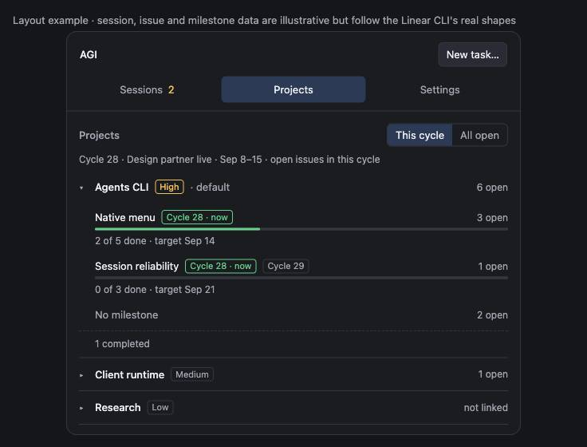
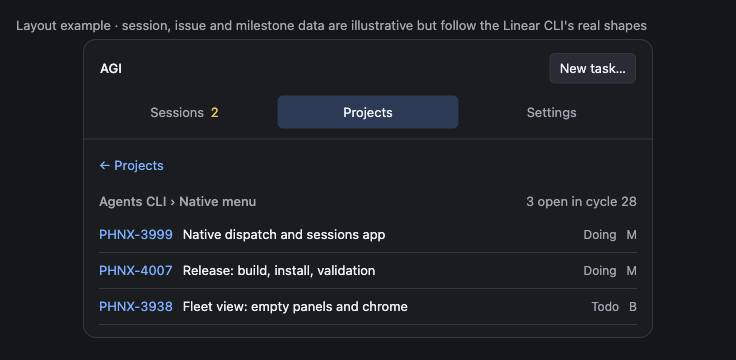
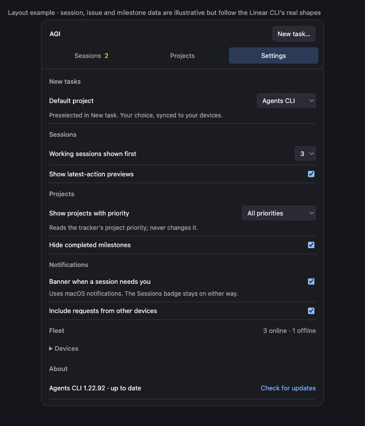

## Focus for review

Keep the existing native notification delivery and reply mechanism. Fix the shared request state before putting a number on the Sessions badge.

- Three tabs, fixed: **Sessions · Projects · Settings**. No customize mode, no drag ordering, no Notifications or Devices tabs. Version moves to Settings → About.
- Sessions: working sessions first (three rows, then Show more), then **Needs you** with only confirmed requests and their real choices, then Idle and Previous collapsed. The tab badge counts confirmed requests.
- Projects shows tracker data and nothing else: each project → its milestones → their issues. Every milestone shows which cycle its open issues sit in, so several milestones can share the current cycle. One filter: **This cycle** (default) or **All open**.
- Settings holds every preference: default project for New task, rows shown, previews, project priority filter, hide completed milestones, banners, other-device requests, a compact fleet list, and About.

<aside class="artifact-callout">Review draft only. No product changes have been made. The clickable layout uses illustrative sessions, issues and milestones shaped like the installed Linear CLI's JSON; the two requests are not a measurement of live sessions.</aside>

<figure class="artifact-figure artifact-behavior">
<section data-state="current" data-evidence="mockup">
<h3>Current menu: duplicated sessions and unrelated counts</h3>
<svg viewBox="0 0 480 390" role="img" aria-label="An anonymized reconstruction of the supplied native menu: version banner, three different attention counts, active sessions, routines, tickets, rich recent sessions, and notifications">
<rect x="1" y="1" width="478" height="388" rx="12" fill="#24252b" stroke="#454650"/>
<g font-family="system-ui,sans-serif" font-size="15" fill="#f2f2f5">
<text x="18" y="30" fill="#b2b4be">agents-cli 1.22.92</text><text x="300" y="30" fill="#f4cf73">1 needs you</text>
<path d="M18 44H462M18 108H462M18 182H462M18 249H462M18 339H462" stroke="#454650"/>
<text x="18" y="70">Sessions</text><text x="112" y="70" fill="#f4cf73">10 need you</text>
<text x="18" y="96" fill="#f4cf73">NEEDS YOU (3): load + routine problems</text>
<text x="18" y="133" fill="#b2b4be">ACTIVE · grouped by project</text>
<text x="30" y="157">Agent · host · terminal · first-line preview</text>
<text x="18" y="207" fill="#b2b4be">ROUTINES</text><text x="18" y="233" fill="#b2b4be">RECENT TICKETS</text>
<text x="18" y="274" fill="#b2b4be">RECENT · same sessions again</text>
<text x="30" y="301">Session title · status · age</text><text x="30" y="322" fill="#b2b4be">Fuller preview and PR text</text>
<text x="18" y="367">Notifications</text><text x="170" y="367" fill="#b2b4be">No notifications today</text>
</g></svg>
<figcaption>Layout reconstructed from the owner's screenshots. The three totals measure different things. Native Notification Center can contain banners while this submenu is empty.</figcaption>
</section>
<section data-state="proposed" data-evidence="mockup">
<h3>Proposed: Sessions tab, working first, confirmed requests below</h3>

<figcaption>Illustrative layout. A session title opens its details; PR and issue links open their exact destination. The Sessions badge equals the confirmed requests listed under Needs you.</figcaption>
</section>
</figure>

<figure class="artifact-figure">

<figcaption>Projects → milestones. Cycle chips come from the milestone's open issues, so two milestones can both read Cycle 28 · now. This cycle hides milestones with nothing in the current cycle and says how many it hid; All open shows every open issue with its own cycle chip.</figcaption>
</figure>

<figure class="artifact-figure">

<figcaption>Milestone → issues. Identifier opens the issue in the tracker. In All open mode each row also carries its cycle and completed issues fold under Done.</figcaption>
</figure>

<figure class="artifact-figure">

<figcaption>Settings is the only place preferences live. The priority filter reads the tracker's project priority and never writes it; today every live project is Low, so High and above would show an empty Projects tab with Show all projects.</figcaption>
</figure>

## Purpose

Make the everyday menu useful without scrolling through duplicate session inventories. The owner wants to see running agents first, understand their latest work, open their linked PR or issue, and see the tracker's projects, milestones, cycles and issues without leaving the menu.

Input alerts must explain the actual pending decision. An agent finishing a turn is not evidence that it requires approval. A question, an approval, a failure and a completed task need different presentation.

This change reuses the CLI session/feed engine, native app, answer transport and tracker integration. It does not create another scheduler, change shared tracker priorities, assign tasks to milestones automatically, or replace the extension's session implementation. Working-first ordering is the owner's explicit choice for this menu; a confirmed request remains visible in the Notifications badge.

## Live findings

Audit: installed agents-cli 1.22.92, source base `c98582f47230`, September 10, 2026, approximately 00:42–00:45 Pacific. The captured fleet feed contained **nine attention records, all classified as permission**. Eight originated as `idle_prompt`; one originated as `permission_prompt`. These are observed classifications, not nine verified human decisions. One fleet scope was unavailable, so the snapshot is not a complete fleet census.

| Inspected session | Actual current evidence | Assessment |
| --- | --- | --- |
| Completed “pong” task | User requested exactly `pong`; assistant replied `pong`, ended its turn, and the live terminal has an empty prompt. An idle reminder arrived one minute later. | Confirmed false “needs input”; no permission dialog or unfinished task. |
| Cloud command | Current terminal explicitly asks “Do you want to proceed?” and offers Yes / session allowance / No. | Confirmed pending permission, despite being old. Age alone cannot clear it. |
| Browser integration | Last response asks which browser data directory to use; current terminal is at an empty prompt. | A real free-text choice, incorrectly classified as command permission. |
| Report update | Last response describes actions awaiting the user's go-ahead; no pending tool appears in the transcript. | A conversational consent request, not evidence for command permission buttons. |

Processes, transcript records, hook files and two remote terminal panes were checked; a local browser-integration terminal capture was inspected. No input was sent to these sessions. Raw identifiers and captures remain in ignored task scratch because they contain private session data. This small, selected sample does not establish a reliability percentage.

The incoming hook preserves `notificationType`, but `kindFromBlock` maps every notification to permission: [`feed.ts:799`](https://github.com/phnx-labs/agi-cli/blob/c98582f47230/cli/src/lib/feed/feed.ts#L799), [`attention.ts:261`](https://github.com/phnx-labs/agi-cli/blob/c98582f47230/cli/src/lib/feed/attention.ts#L261). This explains how the generic “Claude is waiting for your input” message can receive Approve/Deny controls. It does not independently establish the origin of every historical banner in the screenshots.

Other confirmed defects compound the problem:

- The menu's Notifications submenu reads raw feed blocks within 24 hours, while banners use reconciled attention. Failed loading is rendered as an empty list. Its “unanswered” flag incorrectly uses deliverable attribution (`ticket`, `pr`, `worktree`, `unassigned`): `RecentSectionBuilder.swift:244–284`, `feed-outcome.ts:22–29`.
- Native request IDs already use the attention key, but the helper never withdraws delivered notifications when that request resolves. Delivery is marked before confirmed posting: `Notifier.swift:453–458`, `daemon/attention-notify-service.ts:154–155`.
- Fleet attention is visible in the menu; native posting currently begins from local active sessions. A remote row therefore does not prove delivery to the operator's Mac: `daemon/attention-notify-service.ts:118–123`, `menubar/notify-desktop.ts:176–178`.
- The initial 15-task result was a configured agent's open-task subset. A subsequent authenticated `linear tasks --all --project AGI --status open --json` returned 23 open tasks, none assigned to milestones. Historical assignments exist across six milestones. One milestone has 2 completed and 15 canceled tasks; another has 1 completed task. Zero assigned open tasks does not mean empty milestones, and canceled tasks must not look like unfinished work.

## Current architecture

<figure class="artifact-figure artifact-figure-tall artifact-figure-diagram">
<svg viewBox="0 0 440 570" role="img" aria-label="Current component diagram: hooks and session state feed a reconciler for native notifications, while the menu reads both that stream and raw feed blocks separately">
<defs><marker id="current-arrow" markerWidth="8" markerHeight="8" refX="7" refY="4" orient="auto"><path d="M0 0L8 4L0 8Z" fill="#b2b4be"/></marker></defs>
<g font-family="system-ui,sans-serif" font-size="15" fill="#f2f2f5" text-anchor="middle">
<rect x="35" y="15" width="370" height="65" rx="5" fill="#30323b" stroke="#727582"/><text text-anchor="middle" font-size="15" font-family="system-ui,sans-serif" x="220" y="41">Harness hooks + session readers</text><text text-anchor="middle" font-size="15" font-family="system-ui,sans-serif" x="220" y="63" fill="#b2b4be">CLI components · TypeScript</text>
<path d="M220 80V87M220 122V132" stroke="#b2b4be" marker-end="url(#current-arrow)"/><text text-anchor="middle" font-size="15" font-family="system-ui,sans-serif" x="220" y="110" fill="#b2b4be">Hook JSON + transcript state</text>
<rect x="35" y="140" width="370" height="70" rx="5" fill="#30323b" stroke="#727582"/><text text-anchor="middle" font-size="15" font-family="system-ui,sans-serif" x="220" y="167">Attention reconciler</text><text text-anchor="middle" font-size="15" font-family="system-ui,sans-serif" x="220" y="190" fill="#f4cf73">idle notification → permission</text>
<path d="M220 210V217M220 252V259" stroke="#b2b4be" marker-end="url(#current-arrow)"/><text text-anchor="middle" font-size="15" font-family="system-ui,sans-serif" x="220" y="240" fill="#b2b4be">Attention events · NDJSON / CLI calls</text>
<rect x="35" y="267" width="370" height="74" rx="5" fill="#394b68" stroke="#8cbcff"/><text text-anchor="middle" font-size="15" font-family="system-ui,sans-serif" x="220" y="293">Menu rows + native banners</text><text text-anchor="middle" font-size="15" font-family="system-ui,sans-serif" x="220" y="318" fill="#b2b4be">Swift UI · separate counts and history</text>
<path d="M220 405V394M220 363V350" stroke="#b2b4be" marker-end="url(#current-arrow)"/><text text-anchor="middle" font-size="15" font-family="system-ui,sans-serif" x="220" y="378" fill="#b2b4be">Also runs feed --filter all --json</text>
<rect x="35" y="413" width="370" height="70" rx="5" fill="#30323b" stroke="#727582"/><text text-anchor="middle" font-size="15" font-family="system-ui,sans-serif" x="220" y="440">Raw feed blocks</text><text text-anchor="middle" font-size="15" font-family="system-ui,sans-serif" x="220" y="462" fill="#f4cf73">24-hour filter; attribution ≠ answer</text>
<text text-anchor="middle" font-size="15" font-family="system-ui,sans-serif" x="220" y="521" fill="#b2b4be">C4 component view · gray: CLI; blue: UI</text>
<text text-anchor="middle" font-size="15" font-family="system-ui,sans-serif" x="220" y="546" fill="#b2b4be">Arrows name data or command transport</text>
</g></svg>
</figure>

## Proposed Changes

**1. Correct request detection and lifecycle at the CLI source.** Preserve the event subtype and use explicit pending questions, plans and permission requests as evidence. An idle reminder alone creates no permission request. Keep inferred conversational questions labeled as such and open the conversation if the exact response contract is unknown. Never turn a long-running tool into a permission request solely because two minutes passed.

Conceptual changes, not applied patches:

```diff
# cli/src/lib/feed/attention.ts + session/state.ts
- notification => permission; elapsed tool time => permission
+ permission_prompt => permission evidence
+ pending structured question / plan => corresponding request
+ idle_prompt => refresh session state; no automatic approval
+ scoped session + request generation => one unresolved record
```

An open block must be reconciled against later transcript/hook evidence. New work, a tool result, an answer or session completion may resolve the matching generation. Banner dismissal does not answer it. A genuinely old permission remains pending while still confirmed; uncertain stale state becomes “Could not verify request,” with an Open session action and no invented approval controls. Keep actual failed/unfinished work discoverable without labeling every failure a question.

Time-sensitive evidence must expire even when transcript content is unchanged. `active.ts:1291–1292` currently caches computed signals by file mtime and PID liveness, so a 30-minute conversational-question threshold can remain frozen. Cache parsed content separately and recompute time-based classifications; use actual transcript event timestamps, not filesystem mtime, as activity evidence.

**2. Project that same request record everywhere.** The Sessions tab's Needs you group, its badge, session detail and native banners share identity, type, state and supported actions. Remove the separate raw-block menu parser and any status-color fallback that resurrects a resolved request. Use host plus session plus request generation, not bare session ID.

```diff
# RecentSectionBuilder.swift + FeedModels.swift + SessionRowModel.swift
- notifications from raw blocks; unanswered from outcome.kind
- attention lookup by unscoped session ID
+ Notifications from reconciled unresolved requests
+ attribution links independent of request state
+ explicit unavailable state when a feed scope cannot be read

# daemon/attention-notify-service.ts + Notifier.swift
- fire-and-forget delivery; unconditional permission actions
+ acknowledge posting, retry failures, deduplicate request generation
+ render only supported actions; withdraw resolved generation by key
```

Reuse the installed notification sender and `agents feed answer` response path. The daemon, not a UI timer, must own delivery of fleet requests to the selected personal device. Reuse its existing fleet feed aggregation and avoid a new remote poll for each menu view. Verify local and remote delivery, restart replay, and duplicate suppression before claiming this Mac receives the fleet's requests. OS notification history is not the source of unresolved state: users can dismiss a banner without answering.

**3. Replace the long menu with three fixed tabs.** Keep the existing status item, session window, row presentation, feed stream and dispatch behavior. Build the tabbed content in the helper's native popover; the present `NSMenu` does not itself supply this layout. Delete the duplicate ACTIVE/RECENT rendering from the root menu. The excerpt below is a presentation contract:

```diff
# StatusItemController.swift + native session views
- version banner + multiple attention totals
- ACTIVE rows + RECENT rows + expanded auxiliary lists
- Routines / Tickets / Notifications / Devices submenus
+ tabs, fixed order: Sessions | Projects | Settings
+ Sessions: Working (N rows + Show more) → Needs you (confirmed only) → Idle → Previous
+ Sessions badge = confirmed unresolved requests; no other totals anywhere
+ Projects: tracker projects → milestones (cycle chips) → issues; This cycle | All open
+ Settings: default project, rows, previews, priority filter, completed milestones,
+   banners, other-device requests, fleet list, About (version + update)
+ PR and issue URLs open directly; New task stays in the header
```

A blocked session is listed under Needs you with its exact prompt and only the choices the harness offers; working rows remain first as requested. No session disappears merely because it is not in the initial three. Device load and routine failures are diagnostics in Settings → Fleet, excluded from the request count. There is no per-panel customization: the tabs are fixed, and every preference is a row in Settings so a change is made in one place and synced with the user's other preferences.

**4. Normalize links once, upstream.** Keep exact PR repository, number and URL, ticket ID and URL, and separately fetched PR state with freshness. Bind a tool result to the command that produced it; do not attach an unrelated later PR URL. Missing PR checks render “Status unavailable,” not “checks running.” Reuse the preview/identity work in PR #3497 after coordinating ownership.

**5. Projects tab: the tracker's projects, milestones, cycles and issues.** A personal preferences record owns `defaultProjectId` and `projectPriorityFilter`; shared `ProjectDef` keeps repository and tracker metadata. Key preferences by signed-in user where available, with an explicit local profile when signed out. Sync only that user's record through the existing user-config mechanism; add its allowlist and merge/isolation coverage rather than promising automatic sync from a new device-only key. The default project only preselects New task; it never reorders or filters the Projects tab.

The Projects tab is a read-only projection of the tracker. Each project row shows name, priority and its open count in the current scope. Expanding it lists milestones; each milestone row shows the cycles its open issues sit in (`Cycle 28 · now`, `Cycle 29`), open count, done-of-total progress and target date. Milestones are project-scoped while cycles are team-scoped time boxes, so a milestone can span cycles and several milestones share one cycle; the chips make that visible instead of forcing milestones under a single cycle. Issues without a milestone stay under **No milestone**. Clicking a milestone opens its issues (identifier, title, state, assignee) with a breadcrumb back. The one filter is **This cycle** (open issues whose cycle is the current one; milestones with nothing in it collapse into a one-line count) or **All open** (every open issue, each with its cycle chip; done issues fold under Done).

**Use the existing Linear CLI.** Installed `linear-cli 0.21.1` supports these authenticated reads. The native app already calls it through `AgentsCLI` and `LinearTickets`, including project binding, filters and a 90-second cache; reuse that path.

```sh
linear projects --json                     # id, name, state, progress, priority (1 urgent … 4 low, 0 none)
linear cycles --json                       # number, name, startsAt, endsAt, completedAt
linear milestones list <project-id> --json # id, name, description, targetDate
linear tasks --all --project <project-id> --status open --json
linear tasks --all --project <project-id> --status done --json
```

Verified 2026-09-10 against the live workspace: `linear tasks … --json` returns an object with `count` and `issues`, and each issue carries `identifier`, `title`, `state{name,type}`, `cycle{number,name}`, `projectMilestone{name}`, `assignee{name}`, `priority` and `url`. That is enough to build the tab: the current cycle is the one whose `startsAt ≤ now < endsAt` (cycle 28 today), a milestone's cycle chips are the distinct `cycle.number` values of its open issues, and "No milestone" is `projectMilestone == null`. For the AGI project the same query returned 23 open issues, 21 in the current cycle and none assigned to a milestone, so the day-one view is one expanded project with six declared milestones folded as completed and a large No milestone row. `--all` removes the configured agent/delegate filter; `--assignee none` means no person assigned and is not equivalent.

Two small additions belong in the owning Linear CLI before the richer view ships: expose the milestone **id** and the cycle **id** on task JSON (today both are name/number only), and add done/canceled rollups per milestone so progress does not need a second query per milestone. Milestone list stops at 100, project detail at 50; task queries paginate in 100-record pages up to a safety cap and must expose partial coverage. Reuse or extend the Linear CLI contract rather than add another GraphQL client in the menu or poll broad fleet-probing `projects status` on redraw.

Existing `UserDefaults` patterns cover dispatch defaults and project selection. Reuse these controls and consolidate the local project-to-Linear override with the canonical binding. The saved default project is distinct from the most recently selected project.

## Proposed architecture

<figure class="artifact-figure artifact-figure-tall artifact-figure-diagram">
<svg viewBox="0 0 440 530" role="img" aria-label="Proposed component diagram: harness evidence enters a canonical CLI reconciler, one scoped request record reaches both native menu and notifications, and answers go back through the existing feed answer command">
<defs><marker id="proposed-arrow" markerWidth="8" markerHeight="8" refX="7" refY="4" orient="auto"><path d="M0 0L8 4L0 8Z" fill="#b2b4be"/></marker></defs>
<g font-family="system-ui,sans-serif" font-size="15" fill="#f2f2f5" text-anchor="middle">
<rect x="40" y="15" width="360" height="64" rx="5" fill="#30323b" stroke="#727582"/><text text-anchor="middle" font-size="15" font-family="system-ui,sans-serif" x="220" y="40">Harness hooks + transcript evidence</text><text text-anchor="middle" font-size="15" font-family="system-ui,sans-serif" x="220" y="62" fill="#b2b4be">CLI components · local and fleet state</text>
<path d="M220 79V86M220 121V130" stroke="#b2b4be" marker-end="url(#proposed-arrow)"/><text text-anchor="middle" font-size="15" font-family="system-ui,sans-serif" x="220" y="109" fill="#b2b4be">Typed evidence · JSON / NDJSON</text>
<rect x="40" y="138" width="360" height="82" rx="5" fill="#30323b" stroke="#727582"/><text text-anchor="middle" font-size="15" font-family="system-ui,sans-serif" x="220" y="162">Canonical attention reconciler</text><text text-anchor="middle" font-size="15" font-family="system-ui,sans-serif" x="220" y="185">Request type, evidence, actions, resolution</text><text text-anchor="middle" font-size="15" font-family="system-ui,sans-serif" x="220" y="207" fill="#b2b4be">Identity: host + session + generation</text>
<path d="M220 220V229M220 264V271" stroke="#b2b4be" marker-end="url(#proposed-arrow)"/><text text-anchor="middle" font-size="15" font-family="system-ui,sans-serif" x="220" y="251" fill="#b2b4be">Same unresolved record · stream / CLI</text>
<rect x="40" y="279" width="360" height="76" rx="5" fill="#394b68" stroke="#8cbcff"/><text text-anchor="middle" font-size="15" font-family="system-ui,sans-serif" x="220" y="304">Menu Notifications + native banners</text><text text-anchor="middle" font-size="15" font-family="system-ui,sans-serif" x="220" y="328">Badge, exact prompt, supported actions</text><text text-anchor="middle" font-size="15" font-family="system-ui,sans-serif" x="220" y="348" fill="#b2b4be">Swift consumers; daemon owns delivery</text>
<path d="M220 355V363M220 398V407" stroke="#b2b4be" marker-end="url(#proposed-arrow)"/><text text-anchor="middle" font-size="15" font-family="system-ui,sans-serif" x="220" y="386" fill="#b2b4be">Choice or reply · agents feed answer</text>
<rect x="40" y="415" width="360" height="55" rx="5" fill="#30323b" stroke="#727582"/><text text-anchor="middle" font-size="15" font-family="system-ui,sans-serif" x="220" y="439">Existing answer transport + tombstone</text><text text-anchor="middle" font-size="15" font-family="system-ui,sans-serif" x="220" y="460" fill="#b2b4be">Next reconciliation removes this request</text>
<text text-anchor="middle" font-size="15" font-family="system-ui,sans-serif" x="220" y="506" fill="#b2b4be">C4 component view · gray: CLI; blue: UI</text>
</g></svg>
</figure>

## Public Interface

| Action | Result |
| --- | --- |
| Open AGI Menu | Sessions tab: three working previews, then Needs you, Idle and Previous. |
| Click a session, PR or issue | The session opens its details; a PR or issue link opens its exact destination. |
| Answer under Needs you | Existing reply transport; the request stays until delivery is confirmed, then leaves the list and the badge. |
| Open Projects | Tracker projects with priority and open count; This cycle is the default scope with the cycle's number, name and dates on one line. |
| Expand a project | Its milestones with cycle chips, open count, done-of-total and target; No milestone last; folded counts for completed or out-of-cycle milestones. |
| Open a milestone | Its issues with identifier, title, state and assignee; breadcrumb back; Done folded in All open mode. |
| Switch to All open | Every open issue in every cycle, each row carrying its cycle chip. |
| Open Settings | Default project, rows shown, previews, priority filter, completed milestones, banners, other-device requests, fleet list, About with version and Check for updates. |

Expose personal preferences through the owning CLI configuration surface; project defaults remain under the projects noun. Reuse the installed Linear commands above for tracker reads and add the missing id fields there. Final preference command names follow component conventions during implementation; proposed preference commands are not claimed to exist today.

## Plan

- [x] Inspect screenshots, current source, existing tracking and live sessions.
- [x] Run two independent research agents; reconcile findings into this plan.
- [x] Draft the clickable product layout and identify current notification defects.
- [x] Inspect the rendered plan and preview at desktop/narrow widths in both appearances; exercise expansion, section visibility/reorder, options, empty-state recovery and milestone drilldown.
- [x] Redesign to three fixed tabs after owner feedback: Sessions, Projects as a tracker projection with cycle chips and milestone → issue drilldown, Settings; verify the Linear CLI's cycle and issue JSON and exercise every state headlessly.
- [ ] Owner review of this draft before product implementation.
- [ ] After review, refresh PR #3497 and PHNX-3999 ownership and settle shared data contracts.
- [ ] Start fleet implementation workers with disjoint ownership and confirm each starts successfully.
- [ ] Compose changes, run relevant real-service checks, obtain independent review and resolve findings.
- [ ] Land and release the owning Linear CLI JSON additions through its own PR and release process; verify the installed contract before enabling the richer Projects view.
- [ ] Merge through PRs; release the agents CLI and native helper through their separate documented trains; verify the composed installed result.

| Parallel track | Ownership | Acceptance evidence |
| --- | --- | --- |
| Attention and delivery | `feed/attention`, lifecycle evidence and time-aware cache in `session/active`, daemon notifier, native Notifier only | Completed idle task produces no approval; old inferred evidence expires without file changes; real local/remote permission arrives with matching actions and resolves once. |
| Native menu | Status item/popover, the three tabs, Settings rows and session interactions; no notifier logic | No duplicated row; Sessions badge equals the Needs you list; Settings changes apply at once and survive restart; verified on the installed helper. |
| Projects and milestones | Personal preference storage/sync including the priority filter, existing LinearTickets bridge, additive owning Linear CLI JSON contract | Two user profiles remain isolated; default project and filter survive restart/sync; This cycle matches the tracker's current cycle; milestone cycle chips, open counts and No milestone agree with real `linear tasks` output; a filter that matches nothing shows the empty state and the override never persists. |
| Session links | Canonical session PR/ticket fields and row projection, coordinated with #3497 | Real session opens its correct PR and ticket; unknown checks remain unknown. |

Shared interfaces land before composing consumers. Heavy implementation/build work goes to fleet workers. The initial `agents teams` research launches failed before executing: one lacked verified account usage, the other lacked its Linux Codex dependency. Two built-in research agents completed the audit instead. Implementation must preflight healthy worker/harness pairs and verify start, progress and completion; a dispatch command is not evidence of work.

## Validation

Draft verification completed: `artifacts check` and `artifacts render` pass; the preview was rendered headlessly at 736 pixels wide and each captured state was read at the pixel level. Exercised in the preview with no console errors: Sessions rows capped at three with Show more; resolving a request removed it from Needs you and dropped the badge from 2 to 1; Projects in This cycle listed Agents CLI expanded with Native menu (Cycle 28 · now, 3 open), Session reliability (Cycle 28 · now and Cycle 29, 1 open), No milestone (2 open) and a folded completed milestone; opening Native menu showed its three open issues for cycle 28 with identifier links; All open showed done-of-total per milestone and expanded Client runtime with its milestone; Settings changed the default project, row limit, previews, priority filter and completed-milestone folding. The tracker shapes were checked against the live Linear CLI the same day. These checks verify a planning preview, not installed product behavior.

The highest-value end-to-end checks use task-owned sessions so the owner's running sessions receive no test answers:

1. Finish a trivial task, wait for the idle reminder, and confirm no permission badge or banner appears.
2. Trigger a real permission and a structured question separately. Check the native banner, menu item and badge carry the same request identity, exact prompt and supported actions.
3. Answer through the native notification, then repeat through the menu on a new request. Verify the target terminal receives the response, the matching request clears, and its banner withdraws. Dismiss a different banner and verify it remains unresolved.
4. Repeat from a worker session to the operator's desktop. Restart the notifier and replay the feed; no duplicate notification. Simulate posting failure with a real failing delivery path and verify retry/acknowledgement state.
5. Keep a genuinely pending old permission; do not expire it by age. Complete a long-running tool without a prompt; it must not become permission after two minutes. Exercise the 30-minute conversational-evidence boundary while PID and file mtime remain unchanged; cached parsing must not freeze classification. A recently touched transcript containing only old events must not count as new activity.
6. Open a real session's exact PR and ticket; compare destinations with transcript evidence. Confirm failed/unknown PR checks do not appear as running.
7. Exercise the capped list and expansion, every Settings row, the priority filter with its empty state and temporary override, the default project preselecting New task, and Projects → milestone → issues in This cycle and All open against a real tracker project, in both appearances. Confirm a milestone with issues in two cycles shows both chips and that This cycle counts only issues whose cycle is current. Verify persistence and isolation across two users. Verify the installed helper after its independent release.

Co-located regression tests protect these distinct failures; real process/service integration is required in addition. Use component scripts for builds/tests/releases and offload heavy checks. Do not install a dev build over the production `agents` binary.

## Risks

| Risk | Evidence and mitigation |
| --- | --- |
| Removing false alerts also hides real free-text decisions | `state.ts:301–303,543–548`: retain explicit or inferred question evidence separately; never equate empty terminal prompt with completed work. |
| A resolved request reappears | `SessionRowModel.swift:129–171`: remove independent waiting-state overrides; compare resolution against scoped generation. |
| Old banner answers a different prompt | `Notifier.swift:170–174`: validate current request generation before delivering; unsupported or stale action fails visibly. |
| Per-prompt choices differ from harness defaults | `attention.ts:179–190`, `Notifier.swift:329–336`: preserve actual supported choices; omit unverified session-wide allowance. |
| Preference leaks or never syncs | `state.ts:1050–1056`: explicit user identity, sync allowlist and reconciliation; signed-out local profile remains separate. |
| Milestone completeness is overstated | Installed Linear CLI's JSON omits rollups and task milestone IDs; declaration queries cap at 50/100, and canceled tasks count in human-view totals. Add fields and coverage at the owning CLI; distinguish open/completed/canceled and preserve No milestone. |
| A milestone spans cycles or a cycle holds several milestones | Verified shapes: cycles are team-scoped, milestones project-scoped, issues carry both. Chips derive from each milestone's open issues, so both cases render truthfully; never nest milestones under one cycle. |
| Priority filter hides every project | Live tracker 2026-09-10: all four projects are Low, so High and above matches nothing. The empty state names each project's priority and offers Show all projects (unsaved) and a link to Settings; the default project and New task ignore the filter, so dispatch keeps working. |
| Existing preview work is overwritten | PR #3497 touches shared session/feed paths; coordinate and compose with its owner before editing. |

Independent research recommendations on notification subtype, attribution-vs-answer state, scoped identity, banner withdrawal, fleet delivery scope and milestone coverage are adopted. Replacing the notification mechanism or using OS history as request truth is rejected because the existing answer lifecycle is reusable and dismissal is not resolution.

## Tracking

- [PHNX-3999: AGI Menu](https://linear.app/getrush/issue/PHNX-3999) is the existing product work.
- [PHNX-4007: release and validation](https://linear.app/getrush/issue/PHNX-4007) owns the delivery follow-through.
- [PHNX-3939: session preview truth](https://linear.app/getrush/issue/PHNX-3939) and [PR #3497](https://github.com/phnx-labs/agi-cli/pull/3497) overlap session/feed work and must be reused.

Tracker state remains unchanged during this design iteration. This draft is planning work, not a claim that the menu or notifications have shipped.
