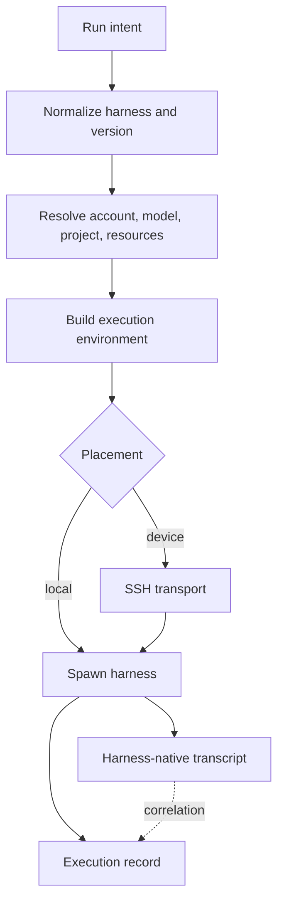
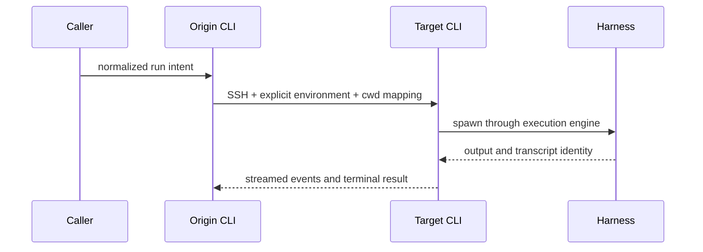

# Agent runs and execution

A run is an invocation of an agent harness with resolved identity, configuration, and
execution context. Local commands, remote dispatch, team members, routines, and recovery
all converge on one execution engine. The callers decide intent; the engine owns the
meaning of launching an agent.

## Run identity and context

The harness and version identify the executable contract. The binary comes from
the one managed installation per harness (`ensureHarnessInstallation`, label
`main`) unless `@<label>` pins an expert copy. An account is a credential slot,
not a second installation: `agents run claude#work` (or `--account work`) sets
the spawn HOME to that account's slot on this device
(`~/.agents/.history/accounts/<harness>/<accountId>/`). Resolution is ordered
and fail-loud: an existing slot on this device; else a provisionable worker
slot materialized at spawn time when the durable key is present (not only on
the daemon tick); else a leftover recorded home label; else identity match
across installed version homes; else fail loud, naming
`agents accounts add` / `agents accounts login`. Slots are created by
`agents accounts add <harness> [name]` on a headed device. Balanced/available
rotation enumerates those slots (plus leftover homes) and never launches a
slot whose verdict is outside `{live, unverified}`. Harnesses that isolate by
adopting `~/.<config>` (no slotEnv / no config-dir env) hold one active slot
per device — `accounts default` repoints the symlink; a run of a non-default
account fails loud, and after HOME resolution a default whose adopted symlink
does not point at that account's home also fails loud rather than launching
into the wrong config. Remote `--device` forwards `#name` unchanged; the peer
resolves its own slot. Account, model, mode, project, resource snapshot, actor, and parent-session
lineage are resolved before spawn. The launch identifier correlates hooks and
remote boundaries even when the harness does not reveal its eventual conversation
identifier at process start.

Environment assembly has a defined precedence and allowlist. Data intended for the
harness must survive every boundary it crosses: local spawn, SSH dispatch, teams,
routines, and recovery. A remote path that drops actor, credential, or lineage fields is
not a reduced mode; it is an incomplete execution path.

## Placement is transport, not a second engine

Placement chooses the machine after intent is normalized. Remote dispatch serializes the
same command and environment contract, maps the working directory, and starts the same
engine on the target. Interactive remote work uses a reconnectable terminal transport so
link loss does not kill the harness. If that durability prerequisite is unavailable, the
launch fails before doing work. When the local SSH client exits — clean detach,
agent quit, or a drop that is not auto-reconnecting — the CLI prints the full
session id and a resume command so the shell is not a dead end; get back in with
`agents ps focus <id>`, or `agents run auto --resume <id>` once the session has ended.
When the session id is known before the TTY is taken (Claude, or a resume),
it is also printed as the stream starts.

## Runs and sessions are different records

An execution record answers whether an attempted unit of work ran, failed, timed out,
was skipped, or was blocked before a harness started. A session answers what happened in
a conversation. A successful run commonly links to a session, but a failed prerequisite,
command-only task, or missed routine may have no session at all. Neither record should be
fabricated to stand in for the other.

## Recovery and fallback

Native resume is valid only when the transcript belongs to a healthy compatible harness
version. When that version is unavailable, recovery starts a healthy version of the same
harness and reconstructs context from the indexed conversation. Recovery does not
silently switch harness families. Account fallback is bounded by the requested policy
and records which attempt actually ran.

## Failure boundaries

Missing binaries, unsupported capabilities, unavailable accounts, unsafe remote
context, stale repositories, and unforwardable options fail with a task-level reason.
No boundary reports success after dropping required behavior. Retry applies only where
the failure class is explicitly safe to repeat.
