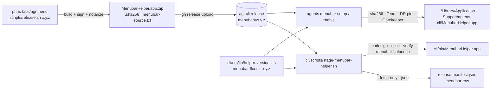

<!-- guide -->
# Menu bar (AGI Menu) — the cross-repo contract

The macOS menu-bar helper is **AGI Menu**. Its source, behavior, and internals
live in their own repo, [phnx-labs/agi-menu](https://github.com/phnx-labs/agi-menu)
(private; split out of `cli/menubar/` on 2026-09-10, PHNX-4036). Everything
about what the helper *does* — the dropdown, the quick-issue bar, the Sessions
window, notifications, the daemon-down watchdog, the single-instance lock, the
bounded child spawner, the self-tests — is documented there:

- [agi-menu `docs/menubar.md`](https://github.com/phnx-labs/agi-menu/blob/main/docs/menubar.md)
- [agi-menu `AGENTS.md`](https://github.com/phnx-labs/agi-menu/blob/main/AGENTS.md)

This page is the **contract between the two repos**: what agents-cli consumes,
at which address, and what each side must not change.

## What agents-cli consumes

| Item | Value | Where it is pinned |
|---|---|---|
| Release repo + tag | `phnx-labs/agi-cli`, tag **`menubar/v<x.y.z>`** (this public repo; agi-menu is private, an installed CLI downloads anonymously) | `HELPER_RELEASE_REPO` in `src/lib/helper-download.ts`; `helperTag('menubar', …)` in `src/lib/helper-versions.ts` |
| Assets | `MenubarHelper.app.zip` (`ditto -c -k --keepParent`, so `MenubarHelper.app/` is the top-level entry), `MenubarHelper.app.zip.sha256` (`<hex>  MenubarHelper.app.zip`), `menubar-source.txt` (provenance: `repo=`/`commit=`/`tag=`/`version=`; absent on releases cut before the split) | `MENUBAR_HELPER_ASSET` in `src/lib/menubar/download-menubar.ts`; `parseSha256Asset` in `src/lib/sha256-asset.ts` |
| Floor | the `menubar` entry in `HELPER_RELEASES` — the build this CLI was tested against; resolution may pick newer, never older | `src/lib/helper-versions.ts` |
| Bundle folder | `MenubarHelper.app` | `MENUBAR_HELPER_APP_NAME` |
| Executable | `AGI Menu` (what Accessibility settings and the "would like to control this computer" prompt show) | `MENUBAR_HELPER_EXECUTABLE_NAME` in `src/lib/menubar/install-menubar.ts` |
| Bundle id | `com.phnx-labs.agents-menubar` (a dev build signs as `….dev`) | `MENUBAR_HELPER_BUNDLE_ID`, `SERVICE_LABEL_BASE` |
| Signer | Developer ID, Team `2HTP252L87`, notarized + stapled | `EXPECTED_TEAM_ID` in `src/lib/helper-download.ts` |
| Designated requirement | `identifier "com.phnx-labs.agents-menubar" … certificate leaf[subject.OU] = "2HTP252L87"` | `verifyDesignatedRequirement`; `scripts/verify-menubar-helper.sh` |
| Snapshot feed | `agents menubar snapshot --json` (read-only; same rows and status words as `agents sessions --active --local --json`) | `src/lib/menubar/snapshot.ts`, `src/commands/menubar.ts` |

The **designated requirement is load-bearing**: macOS keys the helper's
Accessibility (TCC) grant to it and re-validates every new version against it.
A release whose DR drops the bundle id or the Team — an ad-hoc signature, a
different identity, a CDHash-pinned requirement — silently revokes every user's
grant and re-prompts them on the next paste. Both `download-menubar.ts` (before
install) and `scripts/verify-menubar-helper.sh` (after staging) refuse such a
bundle.

## How a build reaches a user



1. **Publish** (in agi-menu, on a Mac with the signing identity):
   `agents secrets exec apple.com -- scripts/release.sh <x.y.z>`. Helper releases
   are immutable — the script refuses an already-published tag.
2. **Pin** (here): bump `menubar` in `src/lib/helper-versions.ts` to `<x.y.z>`.
   The tag makes the build downloadable; the floor is what makes a CLI ask for
   it. The floor file is also the helper's **release-manifest input**, so the
   bump is what makes `scripts/release-attestation-produce.sh --with-helpers`
   re-record the row from the published asset.
3. **Install** (on a user's Mac): `agents menubar setup` / `enable` (and the
   startup self-heal, from a bundled or cached copy only) download, verify, and
   install it. No build happens on any user machine.

### Staging a bundle in this repo

```bash
cli/scripts/stage-menubar-helper.sh                 # macOS: download, verify, extract to cli/bin/MenubarHelper.app
cli/scripts/stage-menubar-helper.sh --fetch-only    # any OS: download + sha256-verify only
cli/scripts/stage-menubar-helper.sh --json          # machine-readable {floor, tag, assetUrl, zip, sha256, source, app}
cli/scripts/stage-menubar-helper.sh --print-floor   # the resolved floor, nothing downloaded
```

`cli/bin/MenubarHelper.app` is the installer's working-tree source
(`sourceAppPath()` in `install-menubar.ts`), so a staged bundle is what
`agents-dev menubar setup` installs from a checkout. An agi-menu developer
testing a local build copies it to the same path. `scripts/remote-sign-mac.sh`
runs the stage on the release home base and pulls the result back.

## What each side must not change

- **agi-menu** must keep publishing to `phnx-labs/agi-cli` at `menubar/v<x.y.z>`
  with the asset names above, the bundle folder `MenubarHelper.app`, the
  executable `AGI Menu`, the bundle id, the Team, and a notarized + stapled
  Developer ID signature. It must keep the helper read-only with respect to
  scheduling (spec RT-11): it renders CLI state and requests actions through
  the CLI; it owns no cron, countdown, or readiness loop.
- **agents-cli** must keep resolving exactly that address from the floor, keep
  `agents menubar snapshot --json` and the `agents feed` / `sessions` JSON shapes
  the helper renders stable (see `docs/specifications.md` §Sessions), and must
  never build the helper — there is no source here to build from, and a
  rebuild-on-release is exactly what owner requirement R3 forbids.

## Commands

`agents menubar setup` (configure end-to-end: one instance, started at login),
`enable`, `disable`, `status`, `doctor`, and the read-only `snapshot --json` the
helper polls. Full flag reference: [command-index.md](command-index.md#menubar--manage-agi-menu-running-sessions-agents-awaiting-input-routines).

## Files the CLI owns

| Path | Purpose |
|---|---|
| `~/Library/LaunchAgents/com.phnx-labs.agents-menubar.plist` | launchd service |
| `~/Library/Application Support/agents-cli/MenubarHelper.app` | installed helper bundle |
| `~/Library/Application Support/agents-cli/.menubar-version` | installed-version stamp |
| `~/Library/Application Support/agents-cli/.menubar-last-heal` | last self-heal reinstall, epoch ms — the non-owner takeover cooldown |
| `~/Library/Application Support/agents-cli/.menubar-tcc-migrated` | marks the one-time ad-hoc -> Developer ID `tccutil reset Accessibility` as done |
| `~/.agents/.cache/state/menubar.disabled` | sticky opt-out marker |
| `~/.agents/.cache/helpers/menubar/menubar.log` | helper stdout / stderr |
| `~/.agents/.cache/menubar/mac-helper/v<x.y.z>/` | downloaded + verified release cache, one dir per tag |

The helper's own state files (`~/.agents/.history/menubar/…`, the feed
notification ledger, the screenshot OCR index) are documented in agi-menu.
