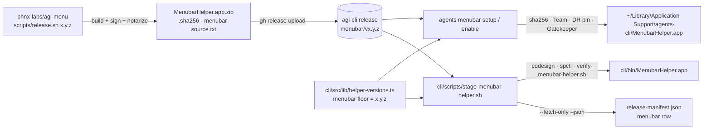

<!-- guide -->
# Menu bar (AGI Menu) — the cross-repo contract

The macOS menu-bar helper is **AGI Menu**. Its source, behavior, and internals
live in their own repo, [phnx-labs/agi-menu](https://github.com/phnx-labs/agi-menu)
(private; split out of `cli/menubar/` on 2026-09-10, PHNX-4036). Everything
about what the helper *does* — the dropdown, the quick-issue bar, the Sessions
window, notifications, the daemon-down watchdog, the single-instance lock, the
bounded child spawner, the self-tests — is documented there:

- [agi-menu `docs/menubar.md`](https://github.com/phnx-labs/agi-menu/blob/main/docs/menubar.md)
- [agi-menu `AGENTS.md`](https://github.com/phnx-labs/agi-menu/blob/main/AGENTS.md)

This page is the **contract between the two repos**: what agents-cli consumes,
at which address, and what each side must not change.

## What agents-cli consumes

| Item | Value | Where it is pinned |
|---|---|---|
| Release repo + tag | `phnx-labs/agi-cli`, tag **`menubar/v<x.y.z>`** (this public repo; agi-menu is private, an installed CLI downloads anonymously) | `HELPER_RELEASE_REPO` in `src/lib/helper-download.ts`; `helperTag('menubar', …)` in `src/lib/helper-versions.ts` |
| Assets | `MenubarHelper.app.zip` (`ditto -c -k --keepParent`, so `MenubarHelper.app/` is the top-level entry), `MenubarHelper.app.zip.sha256` (`<hex>  MenubarHelper.app.zip`), `menubar-source.txt` (provenance: `repo=`/`commit=`/`tag=`/`version=`; absent on releases cut before the split) | `MENUBAR_HELPER_ASSET` in `src/lib/menubar/download-menubar.ts`; `parseSha256Asset` in `src/lib/sha256-asset.ts` |
| Floor | the `menubar` entry in `HELPER_RELEASES` — the build this CLI was tested against; resolution may pick newer, never older | `src/lib/helper-versions.ts` |
| Bundle folder | `MenubarHelper.app` | `MENUBAR_HELPER_APP_NAME` |
| Executable | `AGI Menu` (what Accessibility settings and the "would like to control this computer" prompt show) | `MENUBAR_HELPER_EXECUTABLE_NAME` in `src/lib/menubar/install-menubar.ts` |
| Bundle id | `com.phnx-labs.agents-menubar` (a dev build signs as `….dev`) | `MENUBAR_HELPER_BUNDLE_ID`, `SERVICE_LABEL_BASE` |
| Signer | Developer ID, Team `2HTP252L87`, notarized + stapled | `EXPECTED_TEAM_ID` in `src/lib/helper-download.ts` |
| Designated requirement | `identifier "com.phnx-labs.agents-menubar" … certificate leaf[subject.OU] = "2HTP252L87"` | `verifyDesignatedRequirement`; `scripts/verify-menubar-helper.sh` |
| Snapshot feed | `agents menubar snapshot --json` (read-only; same rows and status words as `agents sessions --active --local --json`) | `src/lib/menubar/snapshot.ts`, `src/commands/menubar.ts` |
| Preferences | `snapshot.menuPreferences` — every `menubar.menu.*` key's effective value; written one at a time with `agents config set/unset`. A key with no registered default (`defaultProject`, `headlessAgent`, `headlessFallbackAgent`) is OMITTED when unset, so the menu keeps its own default | `MENUBAR_MENU_PROPERTIES` in `src/lib/config-keys.ts`; the specs in `src/lib/device-config.ts` |
| Device facts | each `snapshot.devices[]` row: `name`, `platform`, `formFactor`, `interactive`, `isLocal`, `preferred`, `role`, `autoEligible`, and `stats` (`null` when never measured) | `src/lib/menubar/snapshot.ts` |
| Project grouping | `confirmedProject` on every session row (`feed watch --json`, `sessions watch --json`, `sessions --active --json`): the registered project, or `null` for Uncategorized | `confirmedProjectForCwd` in `src/lib/projects.ts` |

The **designated requirement is load-bearing**: macOS keys the helper's
Accessibility (TCC) grant to it and re-validates every new version against it.
A release whose DR drops the bundle id or the Team — an ad-hoc signature, a
different identity, a CDHash-pinned requirement — silently revokes every user's
grant and re-prompts them on the next paste. Both `download-menubar.ts` (before
install) and `scripts/verify-menubar-helper.sh` (after staging) refuse such a
bundle.

## How a build reaches a user



1. **Publish** (in agi-menu, on a Mac with the signing identity):
   `agents secrets exec apple.com -- scripts/release.sh <x.y.z>`. Helper releases
   are immutable — the script refuses an already-published tag.
2. **Pin** (here): bump `menubar` in `src/lib/helper-versions.ts` to `<x.y.z>`.
   The tag makes the build downloadable; the floor is what makes a CLI ask for
   it. The floor file is also the helper's **release-manifest input**, so the
   bump is what makes `scripts/release-attestation-produce.sh --with-helpers`
   re-record the row from the published asset.
3. **Install** (on a user's Mac): `agents menubar setup` / `enable` (and the
   startup self-heal, from a bundled or cached copy only) download, verify, and
   install it. No build happens on any user machine.
4. **Update, unattended.** Installed release helpers move to the newest
   published build on their own: `resolveMenubarVersion`
   (`src/lib/menubar/resolve-version.ts`) reads the public release list once a
   day (cached at `~/.agents/.cache/menubar/latest.json`, floor as the offline
   answer, never below the floor), and `updateMenubarHelperIfNewer` downloads
   and verifies that build, swaps it atomically at the same path and identity
   (bundle id + Team, so the Accessibility grant survives), and restarts the
   helper. Two triggers: the daemon's periodic self-heal check `menubar-helper`
   (every six hours; `agents doctor` shows it, `agents sync` runs it)
   and the end of `agents upgrade`. A local-build install, an opted-out Mac and
   a Mac that never enabled the menu bar are left alone; the multi-install
   ownership contest still applies. The floor bump in step 2 is therefore the
   *tested-against* record and the offline answer, not the release switch.

### Staging a bundle in this repo

```bash
cli/scripts/stage-menubar-helper.sh                 # macOS: download, verify, extract to cli/bin/MenubarHelper.app
cli/scripts/stage-menubar-helper.sh --fetch-only    # any OS: download + sha256-verify only
cli/scripts/stage-menubar-helper.sh --json          # machine-readable {floor, tag, assetUrl, zip, sha256, source, app}
cli/scripts/stage-menubar-helper.sh --print-floor   # the resolved floor, nothing downloaded
```

`cli/bin/MenubarHelper.app` is the installer's working-tree source
(`sourceAppPath()` in `install-menubar.ts`), so a staged bundle is what
`agents-dev menubar setup` installs from a checkout. An agi-menu developer
testing a local build copies it to the same path. `scripts/remote-sign-mac.sh`
runs the stage on the release home base and pulls the result back.

## What each side must not change

- **agi-menu** must keep publishing to `phnx-labs/agi-cli` at `menubar/v<x.y.z>`
  with the asset names above, the bundle folder `MenubarHelper.app`, the
  executable `AGI Menu`, the bundle id, the Team, and a notarized + stapled
  Developer ID signature. It must keep the helper read-only with respect to
  scheduling (spec RT-11): it renders CLI state and requests actions through
  the CLI; it owns no cron, countdown, or readiness loop.
- **agents-cli** must keep resolving exactly that address from the floor, keep
  `agents menubar snapshot --json` and the `agents feed` / `sessions` JSON shapes
  the helper renders stable (see `docs/specifications.md` §Sessions), and must
  never build the helper — there is no source here to build from, and a
  rebuild-on-release is exactly what owner requirement R3 forbids.
- **Attention is the CLI's verdict; the helper renders only the actions the
  record carries (PHNX-3999, spec SES-40f).** The `AttentionItem` on
  `agents feed watch --json` and the banner the `attention-notify` daemon posts
  through `"AGI Menu" --notify --category …` are the same record, classified
  from explicit harness evidence: `permission` exists only for a recorded
  `permission_prompt` the transcript corroborates and carries its choices;
  Claude's `idle_prompt` is never a request; a record the CLI could not confirm
  is `kind: unverified` — no `choices`, no `safeDefault`, posted on the `failure`
  category with `open-terminal` only, and refused by `agents feed answer`. The
  helper must not add approval controls a record does not carry, must not
  colour a resolved generation as needing you from its own phase fallback, and
  must not treat a dismissed banner as an answer — the record clears when the
  transcript moves past it.
- **Answering is bounded, exactly-once, and says what it can actually prove
  (PHNX-3999).** `agents feed answer <attention-key> --json` is the one reply
  path, and its result is a typed record the helper branches on rather than a
  boolean:

  | Field | Meaning for the helper |
  |---|---|
  | `status` | `delivered` (this call handed it to a rail) · `already_answered` (another claim owns it; the evidence reported is that claim's) · `unknown` (something may have landed — **do not resend**) · `failed` (confirmed: nothing was delivered, answering again is safe) |
  | `delivery` | `receipt` (a real `MessageReceipt` exists on the block) · `unconfirmed` (no receipt evidence either way) · `failed` (confirmed failure, including a `dropped`/`expired` receipt) |
  | `resolved` | The AGENT's own evidence that it received the answer — a `consumed`/`continued` receipt. A `queued` receipt is delivery, never resolution, so it leaves this `false`. |
  | `receipt` | The block's real receipt, or absent. **Never synthesized** — an answer marker proves a claim was taken, not that anything was delivered. |
  | `code` | Set when `status` is `failed`: `malformed_key` · `no_session` · `stale` · `unverified` · `unauthorized` · `unknown_choice` · `empty_answer` · `refused` · `rail_failed` · `timeout` · `remote_failed`. |
  | `host` | The device that owns the item — the exact target a delivery check re-queries. |
  | `attempt` | Stable identity of the delivery attempt (the claim timestamp), so a check can tell "still unconfirmed" from "a newer attempt replaced it". |

  The helper MUST distinguish the three of these that look alike. A `failed`
  result is the only one that licenses a **Retry answer**. An `unknown` result
  licenses **Check delivery** and nothing else — it means the claim is still
  held precisely so a retry cannot double-send behind a delivery that may have
  landed. A `delivered` result with `delivery: "unconfirmed"` is not a cleared
  card.

  **Check delivery is a read-only verb, never an implicit resend**:
  `agents feed answer <attention-key> --check [--attempt <at>] --json` reports
  the stored claim and the block's real receipt without claiming, routing or
  delivering anything. It is bound to the requested generation and attempt, so a
  stale card can never be resolved by the next question's receipt.

  **Removal from the feed is itself the resolution.** A claim alone no longer
  resolves an item: the block stays `open` with no resolution tombstone until the
  agent itself acknowledges the answer (a `consumed`/`continued` receipt, bound
  to the generation and attempt the claim was taken for) or the transcript moves
  past the block. A `queued` receipt is delivery, not resolution. So the helper
  clears a card when the record leaves `agents feed watch --json`, never because
  an answer call returned.

- **Settings reads facts, it never probes the fleet (PHNX-3999 F25).** Device
  specs come from the fleet-stats cache the CLI already keeps
  (`readStatsCache`), so a Settings render costs no ssh. Every number is `null`
  when it was not observed and the row carries `stale` plus `observedAt` —
  render "unavailable" and an age, never `0` and never a stale number as live.
  `autoEligible` is the CLI's own placement verdict; the menu must not re-derive
  it from `role`.
- **Grouping is the CLI's verdict too (PHNX-3999 F08/F09).** Group by
  `confirmedProject`; `null` means Uncategorized, and the row must stay reachable
  in the full Sessions list. Do not fall back to the `project` field or to the
  cwd's basename — that is precisely the wrong grouping this replaced. An older
  peer that omits the field is reporting unknown capability, not "no project".
- **A title the CLI rejected must not be revived (PHNX-3999 F26/F27).** The CLI
  drops a harness label that is scaffolding (`<bash-input>`, `<command-name>`, a
  bare `/clear`) so the row falls to the generated title and then the user's own
  first prompt. The menu must not reconstruct a title from control text, and must
  accept a better authoritative title that arrives after the first render.

## Commands

`agents menubar setup` (configure end-to-end: one instance, started at login),
`enable`, `disable`, `status`, `doctor`, and the read-only `snapshot --json` the
helper polls. Full flag reference: [command-index.md](command-index.md#menubar--manage-agi-menu-running-sessions-agents-awaiting-input-routines).

## Files the CLI owns

| Path | Purpose |
|---|---|
| `~/Library/LaunchAgents/com.phnx-labs.agents-menubar.plist` | launchd service |
| `~/Library/Application Support/agents-cli/MenubarHelper.app` | installed helper bundle |
| `~/Library/Application Support/agents-cli/.menubar-version` | installed-version stamp |
| `~/Library/Application Support/agents-cli/.menubar-last-heal` | last self-heal reinstall, epoch ms — the non-owner takeover cooldown |
| `~/Library/Application Support/agents-cli/.menubar-tcc-migrated` | marks the one-time ad-hoc -> Developer ID `tccutil reset Accessibility` as done |
| `~/.agents/.cache/state/menubar.disabled` | sticky opt-out marker |
| `~/.agents/.cache/helpers/menubar/menubar.log` | helper stdout / stderr |
| `~/.agents/.cache/menubar/mac-helper/v<x.y.z>/` | downloaded + verified release cache, one dir per tag |
| `~/.agents/.cache/menubar/latest.json` | newest published helper version resolved from the release list, with the time it was read (day-old at most) |

The helper's own state files (`~/.agents/.history/menubar/…`, the feed
notification ledger, the screenshot OCR index) are documented in agi-menu.
