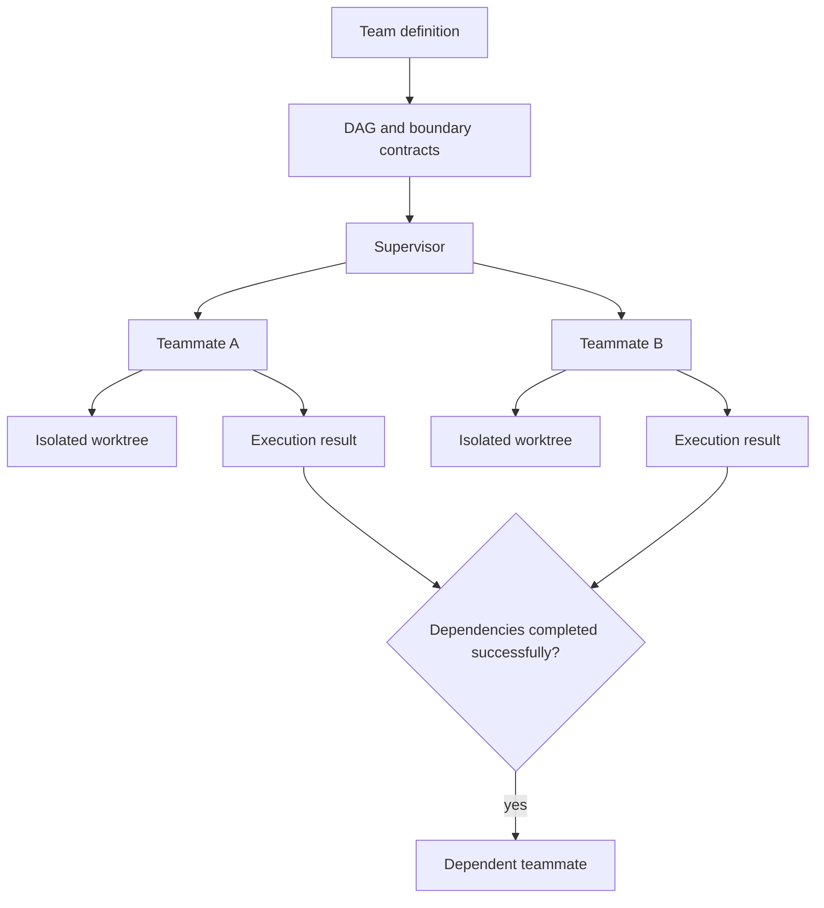
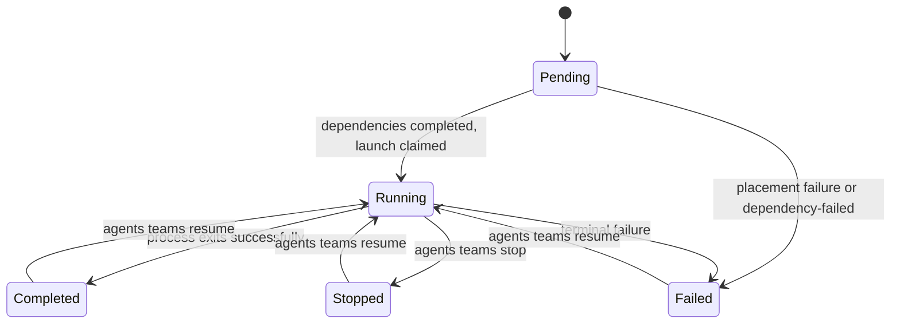

# Teams, workflows, and subagents

Teams coordinate several executions as a directed acyclic graph. Each teammate owns its
process, worktree, conversation, and result; the team registry owns dependency and
supervision state. Boundary contracts state what an upstream task must deliver before a
dependent task can start.

## Team ownership

The team is the durable coordination object. It records members, dependency edges,
placement, execution identifiers, and outcomes. A teammate is an ordinary agent run with
a team identity; it does not get a privileged execution path. Its conversation is useful
evidence, but the supervisor relies on execution state rather than interpreting
transcript prose as completion.

Each coding teammate works in an isolated worktree. Isolation prevents concurrent edits
from colliding, while boundary contracts make the handoff explicit: files owned, facts
established, artifacts produced, or a verdict returned. These contracts guide the
teammates and reviewers; they are not machine-validated gates. Today a dependent becomes
ready when every declared upstream process exits successfully.

Failure evidence is part of the durable teammate record. It contains only facts observed
at a lifecycle boundary: `stage`, stable `code`, sanitized `message`, `exit_code`,
`retryable`, and `observed_at`. Teams never infer a root cause from transcript prose.
`agents teams status` includes this evidence in both its default text and additive JSON
shape, so a new CLI invocation sees the same failure as the supervisor that observed it.

Placement and launch failures are handled per runnable node. A root with a durable
placement failure becomes failed with evidence while other ready roots still launch.
Pool-capacity and load exclusions are transient: the node stays pending with retryable
evidence and the next supervisor wave evaluates placement again. A pending node whose explicit
`--after` dependency failed, stopped, or is missing becomes failed with a
`dependency-failed` record naming every blocker; it does not remain pending until
`--max-waves`. The existing Teams supervisor remains the only graph owner and dispatcher.

Supervision advances ready nodes, observes execution truth, and surfaces failures.
`agents teams resume <team> <teammate>` re-enters the teammate's own session with a
new message, keeping its team/member identity; it clears the previous failure record
rather than keeping it as attempt history.

## Distributed teams

Local and remote teammates use the same launch engine. Placement changes where a task
runs, not its identity, capability rules, or delivery contract. A remote teammate gets an
isolated worktree on its execution device and carries actor/session lineage across SSH.

The team registry remains the coordination owner while the target device owns the
process, worktree, and transcript. Loss of reachability is not completion. The member
stays attributable to its device until reconnection, recovery, or an explicit terminal
decision.

## Workflows and subagents

A workflow is a portable named composition. A subagent is a portable agent role. Teams
are runtime coordination objects. Keeping them separate lets a workflow instantiate a
team and lets teammates use subagent definitions without making either resource
responsible for process supervision.

Both resources use layered resolution and capability-aware projection. Neither creates
a parallel execution engine. Budget and repository-freshness gates run before spawn.

## Invariants

- A member has one execution identity and one owned worktree per attempt.
- Dependency readiness comes from successful upstream process completion, not transcript
  guessing; promised artifacts still require downstream or reviewer verification.
- A failed runnable node cannot prevent an independent ready branch from advancing.
- Failed or missing dependencies terminalize descendants with explicit blocker evidence.
- Local and remote members cross the same capability and execution boundaries.
- Stop and resume are explicit state transitions (`agents teams stop` / `agents teams resume`).
- A workflow or subagent cannot bypass team supervision or the execution engine.
