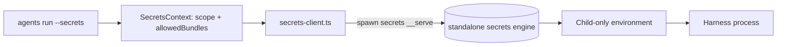

# Secrets and credential custody

**The engine is the standalone [`@phnx-labs/secrets-cli`](https://github.com/phnx-labs/secrets-cli)
package (PHNX-3989).** Bundle storage, the broker, and the keychain/file/vault
backends all live there now — this repo carries none of that code. agents-cli
reaches the engine only through the bounded process client documented in
[`secrets-client.md`](secrets-client.md) (`cli/src/lib/secrets-client.ts`); it
never rebundles the engine (DIST-1), so a missing `secrets` executable fails
loud with install guidance rather than falling back to anything in-repo:

```
agents clis install secrets
# or: npm i -g @phnx-labs/secrets-cli@0.1.2
# or: agents setup secrets
```

`agents secrets <anything>` is a thin exec passthrough (`commands/secrets-passthrough.ts`) that forwards argv verbatim to the installed binary. The macOS broker is `secrets _agent-run`, not `agents daemon` — see [`secrets-agent-process-model.md`](secrets-agent-process-model.md).

Read `secrets-client.md` for the process-client architecture (the wire
protocol, the sync/async transports, the environment contract). This page
covers what agents-cli itself still owns: the policy that scopes secrets
access for a run, and the surfaces built on top of the client.



## What agents-cli still owns

None of this is portable secret-storage behavior, so none of it lives in the
engine — see [`secrets-client.md` §Policy that stays in
agents-cli](secrets-client.md#policy-that-stays-in-agents-cli) for the exact
modules:

- **`agents run --secrets <bundle>`** resolves a bundle at launch and injects
  it into the child environment. Resource-profile scoping (CTX-1) computes
  which bundle names the active profile allows and forwards that as
  `SecretsContext.allowedBundles` on every resolution the run makes; no active
  profile is full trust. `bundle@host` (remote resolution over SSH) is
  agents-cli's own flag syntax, parsed and validated before the client is ever
  called.
- **Browser profile secrets.** `agents browser` resolves a profile's stored
  credentials the same way — through the client, scoped by harness.
- **Accounts.** `agents accounts` reads and writes provider/native credentials
  as secrets bundles (`account-registry.ts`, `claude-account-token.ts`), and
  the reserved per-harness stores (`__<harness>__`, plus the legacy `auth`
  alias for Claude) are agents-cli's own naming convention on top of the
  engine's storage.
- **Fleet sync of reserved credentials.** The daemon publishes only a
  `ready`/`missing`/`invalid` verdict to the owning device's tracked
  `~/.agents/devices/<device>/daemon-state.json`; a serialized,
  45-second-bounded Git exchange delivers those verdicts through the user repo.
  That publish + exchange runs on the single shared-repo committer, the
  `usage-sync` tick (PHNX-4051), so the two daemon ticks never contend for the
  one shared-repo lock. The `auth-sync` service then does the non-git half: one
  deterministically elected ready device asynchronously pushes the real bundle
  only to pinned peers whose last-synced verdict says `missing`, always
  file-backed with a kill-bounded SSH deadline so each destination
  auto-provisions its own machine-local key. Tokens never enter the Git store.

The reserved `auth` bundle is file-backed by construction: it holds long-lived
Claude setup-tokens that usage/probe and unattended workers read without Touch
ID. Creating it on the keychain or vault backend fails loud — the standalone
enforces this on its write path (`WRONG_BACKEND`), and agents-cli asserts it on
every read so a bundle left over from an older layout fails loud instead of
being silently ignored by usage/probe (SEC-GAP-3).

**The usage-read credential is role-gated (USAGE-READ-1/2).** By default a
usage read resolves only this file-based setup-token, never the interactive
login (RUSH-1822) — the guarantee every background caller (daemon usage warm,
auth-health probe, watchdog) keeps, since the fleet-logout revocation came from
an unattended loop firing the interactive token at Anthropic. The setup-token
itself lacks the `user:profile` scope a usage read requires (RUSH-2392), so on
a `worker`/unmarked device — or any `--json` or piped reader — an account
signed in interactively and nothing else reports `usage unavailable (no usage
credential)`. `agents view` names that state precisely instead of folding it
into the generic bucket, which used to send operators back to `claude
setup-token` for a remedy that cannot work (#2987); a cache that has not been
read yet reports the distinct `usage pending`.

The one exception is a **foreground human `agents view` on a `personal` device**
(`selfConfiguredDeviceRole() === 'personal'` **and** `process.stdout.isTTY`): the
read falls through to the interactive OAuth login — the only credential
carrying `user:profile` — so `agents view --refresh` repopulates a live session
(5h) + week (7d) bar for every signed-in account. This mirrors the
exec-credential role gate (EXEC-2a): the personal box authenticates from its
interactive login; unattended loops and machine readers never touch it. A
usage read never *refreshes* an access token — an expired interactive login
reports `expired-credential`, not a silent refresh.

Actors, audit events, and usage counters contain metadata only. Redaction is
defense in depth, not permission to publish raw transcripts.

## Environment contract

See [`secrets-client.md` §Environment contract](secrets-client.md#environment-contract)
for the full `SECRETS_BIN` / `SECRETS_HOME` / `SECRETS_PASSPHRASE` table. The
one thing worth calling out here: `SECRETS_HOME` defaults to `~/.agents`
(`getUserAgentsDir()`), so the standalone adopts a user's pre-extraction store
in place — no copy, no re-encryption (MIG-1).
