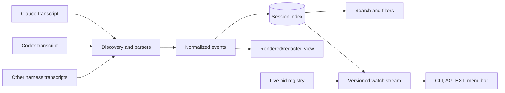

# Sessions and session history

A session is a harness-native conversation. agents-cli does not replace the harness's
transcript format; it discovers those transcripts and builds a normalized, searchable
history across harnesses and devices. The transcript remains durable truth. SQLite,
live-process state, summaries, and UI streams are derived views that can be rebuilt.



## Two identities with different lifetimes

The durable session identifier belongs to the harness transcript. The live identity
maps a currently running process to the session it owns. Live identity is ephemeral and
machine-local; it disappears when the process exits. Harnesses reveal conversation IDs
at different points, so the launch ID is the cross-harness correlation seam during
startup rather than a fabricated universal session ID.

Two writers may contribute live identity: launch-time process registration and harness
hooks that learn the native ID. Readers reconcile them into one view. They must tolerate
arrival order without overwriting richer identity with an earlier partial record.

## History pipeline

Discovery locates harness-native transcripts and records their origin device, harness,
version, project, timestamps, and format. Parsers emit a shared event model for messages,
tool calls, results, usage, and lifecycle signals. The index stores searchable text and
metadata, not a second authoritative transcript.

Incremental scans append or enrich known sessions. Enrichment may fill missing actor,
lineage, cost, or resource-usage fields, but must not erase previously known provenance.
Schema migrations preserve the stable machine-readable envelope described in the
[normative session specification](specifications.md#sessions).

```mermaid
sequenceDiagram
  participant Harness
  participant Scanner
  participant Index
  participant Consumer
  Harness->>Harness: append native transcript
  Scanner->>Harness: discover changed content
  Scanner->>Index: upsert normalized events and metadata
  Index-->>Consumer: reset snapshot with stream version
  Index-->>Consumer: monotonic increments
  Note over Consumer: replace on reset; apply newer increments only
```

## Progress and attention

Session state describes progress, not merely whether a PID exists. Running work is
healthy. Waiting for explicit input, idle unfinished work, crashes, and orphaned remote
work require different recovery actions. Finished work is terminal and must remain
distinct from idle work; otherwise a quiet completed session and silently abandoned work
become indistinguishable.

The live registry contributes liveness, while transcript tails, execution records, and
explicit completion markers contribute progress. A reader that lacks one signal reports
degraded or unknown rather than manufacturing certainty.

Orphaned work — a live agent nobody is driving — is derived, not asserted, and centrally
folded (`foldHostLink` over the pure classifier in `host-link.ts`). An idle or
input-waiting session with no client attached becomes `orphaned` on any client loss. A
still-`running` agent is treated more conservatively: zero tmux clients is the normal
steady state for a detached remote pane (`agents run --device` wraps every remote
interactive run in a detached tmux session), so that alone never flags it. The one signal
that promotes a running agent is a LOST WINDOW — its owning IDE window stopped
republishing its heartbeat, so the host died uncleanly and the agent outlived it. That is
the genuinely-stranded case (a remote agent still alive after its laptop rebooted), and
`hostWindowLost` is the predicate that names it. Mere absence of a client is not a running
orphan; only a window that was there and is now gone.

## Cross-device history

Each transcript has an origin device. Fleet search unions indexed metadata without
pretending remote files are local. Detail reads, resume, migration, and export route to
the owning device through explicit transport. Migration transfers the conversation and
its provenance, then records the new origin; it does not create two independent owners.

Routing a read to the owner depends on the row naming the device the agent actually
runs on, and the box that *launched* a dispatched session is the one that gets this
wrong: it keeps a live shim process carrying the session's id, so the session looks
local there even though the conversation is on a peer. Process locality is not
transcript locality. A read therefore only stays local when this box can genuinely
answer for it — the transcript is on this disk, or the row names another device
outright. Otherwise the owner is recovered from the fleet's own view of who is
running what, and the read follows it. A session that is readable locally never
takes a needless hop, and an owner that cannot be reached is an error rather than an
empty local card.

When the standalone `sessions` CLI (`@phnx-labs/sessions-cli`) is installed, a
read query — list, search, or id lookup — takes a fast path that execs it directly
instead of loading the in-repo session module. Two flag families on that path are
version-gated so an older standalone can never mis-read them as search tokens:
the 0.2.0 metadata filters/sort (`--project`/`--since`/`--until`/`--sort`, the
`@version` suffix, the harness shorthands) forward only when the installed
`sessions` is ≥ 0.2.0, and the point-to-one remote read `agents sessions <query>
--host <target>` (SSH to ONE box, run `sessions … --local`, stream JSON back)
forwards only when it is ≥ 0.3.0 — its own, higher floor. Below a floor, or with no
standalone installed at all, that query stays on the in-repo engine (which
implements the same filters and resolves `--device` against the fleet); nothing
mis-routes or crashes. `--host` targets one box directly.

A **read** `agents sessions <query> --device <name>` that names EXACTLY ONE device
(no explicit `--host`) also takes this path when the local `sessions` is ≥ 0.3.0:
the device is resolved to its SSH target and the query is forwarded as `sessions
<read args> --host ssh://<target>` — the standalone owns the remote hop, replacing
the in-repo peer fan-out for that read (the same collapse `secrets`/`computer`
made). `--host` is point-to-one, so **only a single-device read collapses**; a
**multi-device** query — `--device box mac-mini`, `--device box --device mac-mini`,
or a fan-out sentinel `--device all`/`fleet` — stays on the in-repo `--device`
fan-out, which parses commander's variadic `--device` correctly and merges the
peers. It is safe because the peer may not have the standalone yet: if the remote
`sessions` is not on the peer's PATH the SSH `bash -lc` exits **127**
(command-not-found), and the read **falls through to the in-repo `--device`
fan-out** so it still succeeds — a capability gate keyed on that one signal, a
migration bridge until the fleet is uniformly on 0.3.0, after which the in-repo read
fan-out can be removed (a PHNX-4012 follow-up). Everything else (e.g. 255
unreachable) is a real error and propagates. Below the 0.3.0 host floor, or with no
standalone installed, a `--device` read stays on the in-repo engine exactly as
before. Only reads route this way: a lifecycle `--device` (resume / watch / inject /
focus / …) keeps its in-repo / `runOnPeer` behavior, and an explicit `--host`
always wins over `--device`.

## Off-box backup

`agents sessions export --to-r2` and `agents sessions import --from-r2` are
on-demand backup and restore operations. They do not enable the retired background
R2/CRDT sync cycle.

A signed-in Phoenix user gets the managed backend by default:

```bash
agents sessions export --since 30d --to-r2
agents sessions import --from-r2 --dry-run
agents sessions import --from-r2
```

No personal Cloudflare bucket or `r2.backups` bundle is required. The CLI encrypts
every transcript body locally with AES-256-GCM under a per-account data-encryption
key, and the managed Worker stores only encrypted bundle objects. The key is cached
locally with mode `0600` and escrowed in the account's bearer-protected namespace so
a fresh device signed in to the same Phoenix account can recover it.

That escrow defines the trust boundary: managed backup is confidential against a
raw R2/Cloudflare bucket read, but it is not zero-knowledge against Phoenix because
Phoenix-operated infrastructure can recover the escrowed key. Users who require a
key Phoenix cannot access can force their own bucket:

```bash
agents sessions export --since 30d --to-r2 --byo
agents sessions import --from-r2 --byo
```

The BYO path requires the `r2.backups` secrets bundle. Its `R2_SYNC_ENC_KEY` is the
shared restore key across the user's devices, and the existing
`sessions/<machine>/<agent>/<session>` object layout is unchanged.

The managed endpoint itself (`sessions.agents-cli.sh` — the Worker + R2 bucket) is
provisioned once, by an operator, with `agents sessions backup-setup` (Cloudflare
credentials from the `cloudflare` secrets bundle, e.g. `agents secrets exec
cloudflare -- agents sessions backup-setup`). It is idempotent — re-running
redeploys the current Worker template in place. This is NOT a per-user step: a
signed-in user backs up with zero setup; `backup-setup` is only how the first-party
endpoint is deployed. The BYO path never touches it.

## Derived capabilities

- Search and ranking operate over normalized messages and metadata. A keyword
  content query unions FTS5 hits with the listing page so an indexed transcript
  is returned even when it missed the default cwd/limit window. `--project`,
  `--agent`, and `--routine` still filter that union — a content hit in another
  project does not leak back in. The index covers both sides of the
  conversation: user prompts (`content`) and the agent's own answers
  (`assistant`, weighted lower in ranking), so a phrase that only ever
  appeared in what the agent said is still findable, not just what was asked.
  A `--json` content-search hit carries a short highlighted `snippet` excerpt
  from whichever column matched. `CONTENT_INDEX_VERSION` (`lib/session/db.ts`)
  gates re-extraction independently of file mtime/size, so a future content
  extractor improvement can backfill every already-indexed session on its next
  scan without a destructive reset.
- Each indexed session carries the genuine **full first user turn** as
  `firstUserMessage` — the verbatim originating request, captured at scan time
  and skipping harness-injected scaffolding. It is distinct from `topic` (a
  one-line distillation), `label` / an agent title, and the live row's cleaned
  `userPromptClean`, and it is emitted on `agents sessions --json` and on the
  `agents sessions watch --json` / `agents feed watch --json` streams. Grok
  recovers it via a bounded prefix read of `chat_history.jsonl` so the cheap
  summary-only scan does not open the full log. Its sibling **`lastUserMessage`**
  (schema v48) carries the LATEST genuine turn, which is the operative request of
  a `/continue`d, redirected, or interrupted-and-restated session — and is what
  the row title and the sidebar's Request card are derived from (PHNX-3939).
- Every session row also carries **`request`**, **`timeline`** and **`files`**
  (PHNX-3939). `request` is the latest genuine turn tidied but never rewritten —
  the user's prose joined verbatim, with screenshot / `host:/path` clip
  references and `@dir` mentions split into `attachments`, pasted terminal echo
  counted as `pastedLines`, and a `/name <id>` invocation kept as `command`.
  `timeline` is the narration-anchored step list: one step per line the agent
  SAID, with the tool calls under it folded into per-verb counts plus `failed`
  and `blocked`, and milestones (`worktree created`, `PR opened`); the last 8
  steps ride the row with an `earlier` counter for the rest. `files` is what the
  session created / modified / deleted, from the harness's own ledger where one
  exists. All three are computed by the daemon's reader-gated tick and cached in
  `session_timelines` — never on the request path. `agents sessions trace <id>
  --steps` prints the same fold as text, redacted by default like every other
  derived-label surface. A tool the operator cut short with Ctrl-C counts as
  `blocked`, not `failed`, alongside one a permission rule or hook denied.
  Every string the timeline ships is scrubbed where it is projected — secrets
  redacted (only `--no-redact` opts out) and terminal escapes always stripped —
  because the row is also published into the git-tracked fleet mirror
  (SES-54a).
- Every session row's **headline is a user-anchored name, never the agent's latest
  message** (PHNX-3797). One ladder decides it everywhere — `/rename` label →
  `generatedTitle` → the first-prompt `topic` — implemented once in
  `deriveSessionRecap` (`lib/session/active.ts`) for live rows and
  `sessionHeadline` (`lib/session/title.ts`) for indexed rows, so the CLI list,
  the picker, `sessions watch --json`, and AGI EXT can never disagree about a
  session's name. `generatedTitle` is a short, descriptive **action + object
  headline** ("Triage the AGI board", not just "Triage") produced by the daemon's
  `session-title` service through a swappable `SessionTitleProvider` — the shipped
  default is the cheap cloud model (`--model cheap`, read-only plan mode), and a
  local model backend can be dropped in later without touching the tick. It is
  generated **once** per session and persisted in the index against a hash of the
  user text it came from — so a titled session costs no further model calls, and
  it regenerates only when that first user message changes or on an explicit
  `agents sessions backfill titles --refresh`. Until it runs, the row honestly
  shows the user's own first message. The agent's rolling last line stays where a
  live status belongs: `lastAgentLine` / the preview pane. Each box titles its own
  sessions and publishes them on the fleet session mirror, so a peer's rows carry
  the same headline with no per-row SSH.
- Beside the headline, a live row carries a ranked **secondary line**
  (`importantMessage`): the single most important recent agent message — a pending
  question, then a needs-you block (plan review / permission / input-required),
  then the current activity. It rides the same watch/mirror feed as the title, so
  a client renders a bold title over a dim secondary line without a second query.
- Rendering and sharing redact credential-shaped values and local identity by default.
- Export/import preserves provenance and stable IDs while treating indexes as rebuildable.
- Off-box backup (`sessions export --to-r2` / `import --from-r2`) is **managed-first**:
  a signed-in user backs up to the managed Phoenix store with no bucket to provision,
  every transcript body sealed under a mandatory per-account key that is escrowed for
  zero-setup cross-device recovery but is NOT hidden from Phoenix. `--byo` keeps the
  own-bucket, zero-knowledge path. It is a pure on-demand backup, never a background
  sync (SES-50, SES-51, SES-52).
- Insights and resource-usage analysis are projections; they never mutate transcripts.
- Execution records link to sessions when a conversation exists, but remain independently
queryable when a run failed before session creation.

Raw transcripts are private machine state and are never committed as documentation or
attached directly to public work.


### Remote stream ownership

Fleet `sessions watch --json` and `feed watch --json` publish one row per exact
session id, harness and execution device. `sourceDevice` and `machine` identify
the execution owner. The worker's state and preview win over the origin launcher,
even when that launcher is newer or has more fields. Observer-local terminal ids,
viewing information and reply provenance live in `observerTerminals`; they do not
replace the worker's execution metadata. Disconnect retains the last owner state;
reconnect resets it. Once an owner has answered, stale launcher/history copies
cannot resurrect a session that the owner removed. `--local` remains the raw
observation stream used by the fleet coordinator.

### Process namespace ownership

On Linux, PID-keyed session state belongs to the recorded boot, PID namespace and
init process start time. The init stamp distinguishes recycled namespace inodes.
A foreign observer reads the existing host snapshot without gathering, pruning,
or replacing it. An invisible process is not evidence that it died; each record's
kernel start time also protects against PID reuse.

Legacy migration and reboot recovery require the initial host namespace or a
live canonical daemon verified through kernel socket credentials. A fresh private
HOME can enroll its own namespace. Automatic reuse of a private-container HOME
across namespaces is unsupported, including after the prior namespace exits.
CLI writers are refused with a diagnostic; hooks withhold PID writes and retain
their session-context output. Run in the owning namespace or use a fresh HOME.
There is no automatic namespace takeover or container lifecycle helper.
